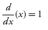
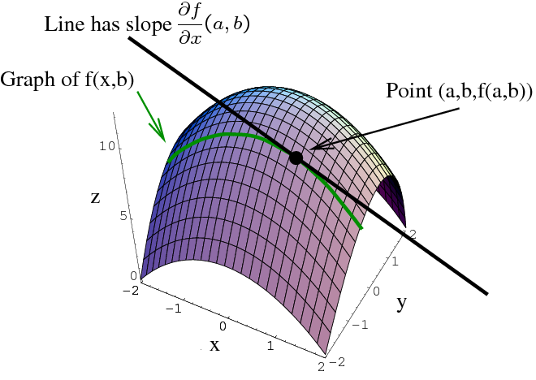
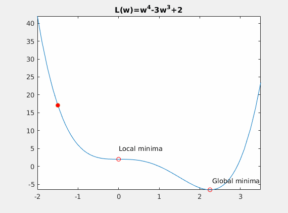
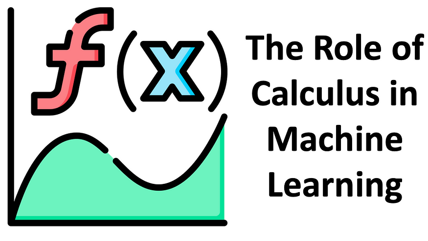

**Calculus in Data Science and it uses**

{width="6.268055555555556in"
height="3.5277777777777777in"}

A calculus is an abstract theory developed in a purely formal way.

The calculus, more properly called analysis is the branch of mathematics
studying the rate of change of quantities (which can be interpreted as
slopes of curves) and the length, area, and volume of objects. The
calculus is divided into differential and integral calculus.

{width="0.8194444444444444in"
height="0.5097222222222222in"}

Differentiation

{width="1.2708333333333333in"
height="0.5097222222222222in"}

Integration

*The word Calculus comes from Latin meaning "small stone",\
Because it is like understanding something by looking at small pieces.*

Calculus is a intrinsic field of maths and especially in many machine
learning algorithms that you cannot think of skipping this course to
learn the essence of Data Science.

**Differential Calculus** cuts something into small pieces to find how
it changes.

**Integral Calculus** joins (integrates) the small pieces together to
find how much there is.

**Gradient Descent**

A gradient measure how much the output of a function changes if you
change the inputs a little bit.

Suppose you have a ball and a bowl. No matter wherever you slide the
ball in the bowl, it will eventually land in the bottom of the bowl.

As you see this ball follows a path that ends at the bottom of the bowl.
We can also say that the ball is descending in the bottom of the bowl.
As you can see from the image the red lines are gradient of the bowl and
the blue line is the path of the ball and as the path of the ball's
slope is decreasing, it is called as gradient descent.

In our machine learning model, our goal is to reduce the cost in our
input data. the cost function is used to monitor the error in
predictions of an ML model. So, minimizing this, basically means getting
to the lowest error value possible or increasing the accuracy of the
model. In short, we increase the accuracy by iterating over a training
data set while tweaking the parameters (the weights and biases) of our
model.

Let's us consider we have a dataset of users with their marks in some of
the subjects and their occupation. Our goal is to predict the occupation
of the person with considering the marks of the person.

{width="6.268055555555556in"
height="1.0486111111111112in"}

In this dataset we have data of John and eve. With the reference data of
john and eve, we have to predict the profession of Adam.

Now think of marks in the subject as a gradient and profession as the
bottom target. You have to optimise your model so that the result it
predicts at the bottom should be accurate. Using John's and Eve's data
we will create gradient descent and tune our model such that if we enter
the marks of john then it should predict result of doctor in the bottom
of gradient and same for Eve. This is our trained model. Now if we give
marks of subject to our model then we can easily predict the profession.

{width="5.831944444444445in"
height="4.374305555555556in"}

In theory this is it for gradient descent, but to calculate and model,
gradient descent requires calculus and now we can see importance of
calculus in machine learning.

First Let's start by the topic that you know till now ie. Linear
Algebra. Let first use linear algebra and its formula for our model.

{width="6.268055555555556in"
height="4.7034722222222225in"}

The basic formula that we can use in this model is

y = m\*x +b

where,

y = predictor, m = slope, x = input, b= y-intercept.

A standard approach to solving this type of problem is to define an
error function (also called a cost function) that measures how "good" a
given line is. This function will take in a (m,b) pair and return an
error value based on how well the line fits our data. To compute this
error for a given line, we'll iterate through each (x,y) point in our
data set and sum the square distances between each point's y value and
the candidate line's y value (computed at mx + b). It's conventional to
square this distance to ensure that it is positive and to make our error
function differentiable.

{width="6.268055555555556in"
height="1.8743055555555554in"}

Lines that fit our data better (where better is defined by our error
function) will result in lower error values. If we minimize this
function, we will get the best line for our data. Since our error
function consists of two parameters (m and b) we can visualize it as a
two-dimensional surface. This is what it looks like for our data set:

{width="6.268055555555556in"
height="2.4631944444444445in"}

Each point in this two-dimensional space represents a line. The height
of the function at each point is the error value for that line. You can
see that some lines yield smaller error values than others (i.e., fit
our data better). When we run gradient descent search, we will start
from some location on this surface and move downhill to find the line
with the lowest error.

In the essence of calculus video, you have seen that to calculate slope,
we use differentiation.

{width="6.268055555555556in"
height="4.445138888888889in"}

The graph of a function z=f(x,y)z=f(x,y) is a surface, and fixing y=by=b
gives a curve (shown in green). The partial derivative
∂f∂x(a,b)∂f∂x(a,b) is the slope of the tangent line to this curve at the
point where x=ax=a.

To run gradient descent on this error function, we first need to compute
its gradient. The gradient will act like a compass and always point us
downhill. To compute it, we will need to differentiate our error
function. Since our function is defined by two parameters (m and b), we
will need to compute a partial derivative for each. These derivatives
work out to be:

We now have all the tools needed to run gradient descent. We can
initialize our search to start at any pair of m and b values (i.e., any
line) and let the gradient descent algorithm march downhill on our error
function towards the best line. Each iteration will update m and b to a
line that yields slightly lower error than the previous iteration. The
direction to move in for each iteration is calculated using the two
partial derivatives from above.

The** Learning Rate** variable controls how large of a step we take
downhill during each iteration. If we take too large of a step, we may
step over the minimum. However, if we take small steps, it will require
many iterations to arrive at the minimum.

While we were able to scratch the surface for learning gradient descent,
there are several additional concepts that are good to be aware of that
we weren't able to discuss. A few of these include:

-   **Convexity** -- In our linear regression problem, there was only
    one minimum. Our error surface
    was [convex](http://en.wikipedia.org/wiki/Convex_function).
    Regardless of where we started, we would eventually arrive at the
    absolute minimum. In general, this need not be the case. It's
    possible to have a problem with local minima that a gradient search
    can get stuck in. There are several approaches to mitigate this
    (e.g., [stochastic gradient
    search](http://en.wikipedia.org/wiki/Stochastic_gradient_descent)).

-   **Convergence** -- We didn't talk about how to determine when the
    search finds a solution. This is typically done by looking for small
    changes in error iteration-to-iteration (e.g., where the gradient is
    near zero).

{width="3.8319444444444444in"
height="3.4770833333333333in"}

**Multivariate Calculus**

Now let's deep dive to Multivariable calculus which will teach calculus
in multivariable data which we will get eventually in the real life.

{width="6.268055555555556in"
height="3.545138888888889in"}

Machine learning, a subfield of artificial intelligence, has
revolutionized industries, from healthcare to finance and beyond. At its
core, machine learning involves developing algorithms that enable
computers to learn patterns from data and make intelligent decisions.
Behind the scenes, calculus plays a pivotal role in making these
algorithms work efficiently and effectively. In this article, we will
explore the indispensable role of calculus in machine learning.

**The Foundations of Calculus**

Before delving into the role of calculus in machine learning, it's
essential to understand what calculus is. Calculus is a branch of
mathematics that deals with rates of change and the accumulation of
quantities. It comprises two primary branches: ***differential
calculus***, which focuses on the concept of ***derivatives***,
and ***integral calculus***, which deals with integrals and the
accumulation of quantities.

**Derivatives: The Heart of Machine Learning**

***Differential calculus***, particularly the concept
of ***derivatives***, is the heart of many machine learning algorithms.
At its core, derivatives measure how a function changes as its input
variables change. **In machine learning, we often use derivatives to
optimize models, minimize errors, and refine predictions.**

**Gradient Descent: The Optimization Workhorse**

One of the most fundamental algorithms in machine learning is **gradient
descent**. It's used to find the optimal parameters of a model that
minimize a predefined cost or loss function. The key idea behind
gradient descent is to iteratively adjust model parameters in the
direction of the steepest descent, as determined by the gradient of the
cost function.

The gradient is essentially a vector of partial derivatives, each
indicating how sensitive the cost function is to changes in a specific
model parameter. Calculus comes into play when computing these partial
derivatives. By applying the **chain rule** and other calculus
techniques, machine learning algorithms efficiently determine how to
adjust model weights and biases to improve predictions.

**Loss Functions: Quantifying Model Performance**

Machine learning models are trained to minimize a loss function, which
quantifies the disparity between model predictions and actual outcomes.
Calculus is crucial for calculating the gradients of these loss
functions, allowing the optimization algorithms to update model
parameters effectively. Common loss functions, such as mean squared
error (MSE) and cross-entropy, rely on derivatives for gradient
computation.

**Activation Functions: Building Neural Networks**

Neural networks, a popular class of machine learning models, utilize
activation functions like sigmoid, ReLU (Rectified Linear Unit), and
tanh (hyperbolic tangent). Calculus helps us understand these functions
and compute their derivatives. This knowledge is essential during the
backpropagation process, where gradients are propagated backward through
the network to update weights and biases, enabling the network to learn.

**Integral Calculus: Less Common but Equally Important**

While differential calculus takes center stage in many machine learning
applications, integral calculus also plays a role, albeit less
frequently. In cases where probabilities, cumulative distribution
functions, or area under curves need to be computed, integrals come into
play. For example, in probabilistic models and Bayesian inference,
integrals help determine likelihoods and posterior probabilities,
facilitating probabilistic reasoning in machine learning.

**Beyond the Basics: Advanced Applications**

Beyond the foundational concepts of calculus, advanced applications in
machine learning leverage more sophisticated calculus techniques:

**Optimization Techniques**

Advanced optimization techniques, such as Newton's method and conjugate
gradient descent, often involve second-order derivatives (Hessian
matrices). These techniques can converge to optimal solutions more
rapidly than basic gradient descent algorithms.

**Reinforcement Learning**

Reinforcement learning, a branch of machine learning focused on
decision-making in sequential environments, relies on dynamic
programming and the Bellman equations. Calculus aids in the formulation
of these equations, enabling the modeling and solving of complex
sequential decision-making problems.

**Regularization**

Regularization techniques like L1 (Lasso) and L2 (Ridge) regularization
introduce penalty terms based on the absolute or squared values of model
parameters. Calculus is used to calculate these penalties, which help
prevent overfitting and enhance the generalization capabilities of
machine learning models.

**Critical Points**

In calculus, the critical points of a function are the values of the
independent variable (usually denoted as "x") where the derivative of
the function is either equal to zero or undefined. These points are
crucial in the study of functions because they often correspond to
points where the function has local extrema (maximum or minimum values)
or points of inflection. Critical points help us analyze the behavior of
functions and locate important features on their graphs.

Here are the two main types of critical points:

**1. Critical Points with Derivative Equal to Zero:**

When the derivative of a function is equal to zero at a specific value
of "x," we have a critical point. Mathematically, if "f(x)" is the
function, and "f'(x)" is its derivative, a critical point occurs at "x =
c" if and only if "f'© = 0." At these points, the function's tangent
line is horizontal, indicating a potential maximum, minimum, or saddle
point.

**2. Critical Points with Undefined Derivative:**

Sometimes, the derivative of a function is undefined at certain points.
These points are also considered critical points. For example, vertical
tangent lines, corners, or cusps in a function's graph can result in
undefined derivatives. To find such critical points, you need to
identify where the derivative is undefined and investigate the behavior
of the function at those points.

To determine the nature of the critical points (i.e., whether they
correspond to maxima, minima, or saddle points), additional analysis is
typically required. This involves using the first and second derivative
tests, which examine the sign and concavity of the derivative near the
critical points.

-   First Derivative Test: This test examines the sign of the derivative
    in the interval around the critical point. If the derivative changes
    from positive to negative as you move through the critical point, it
    indicates a local maximum. Conversely, if the derivative changes
    from negative to positive, it indicates a local minimum. If there's
    no change, it's a saddle point.

-   Second Derivative Test: The second derivative test provides more
    information about the nature of the critical point. If the second
    derivative at a critical point is positive, the point corresponds to
    a local minimum. If it's negative, the point corresponds to a local
    maximum. If the second derivative is zero or undefined, the test is
    inconclusive.

In summary, critical points are essential in calculus because they help
us identify potential places where a function reaches maximum or minimum
values or exhibits other interesting behavior. Analyzing the behavior of
functions at these points is a key part of calculus and optimization
problems.

**Conclusion**

In the dynamic and ever-evolving field of machine learning, calculus
serves as the mathematical foundation upon which intelligent algorithms
are built. From gradient descent optimization to the understanding of
complex neural networks, calculus plays a vital role in shaping the
future of artificial intelligence.

As machine learning continues to advance, so does the need for a deep
understanding of calculus. Professionals and researchers in the field
must embrace this mathematical tool to design, train, and deploy
increasingly sophisticated models that can tackle the complex challenges
of our data-driven world. Calculus is not just a prerequisite; it's an
essential tool for those striving to unlock the full potential of
machine learning.
