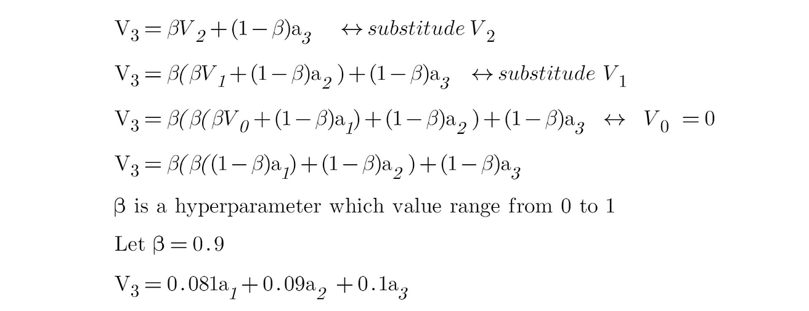

**Deep Learning With Generative AI**

Intelligence is the ability to learn, understand, and apply knowledge to
solve problems, adapt to new situations, and think abstractly.

**What is Artificial Intelligence ?**

Artificial Intelligence (AI) is the field of computer science that
focuses on creating machines and software capable of performing tasks
that typically require human intelligence. These tasks include learning
from experience, understanding natural language, recognizing patterns,
solving problems, and making decisions.

*Geoffrey Hinton, the software engineer who is often regarded as the
"godfather of artificial intelligence" has said that he is "very
worried" about the artificial intelligence technology "taking lots of
mundane jobs"*

{width="3.868354111986002in"
height="2.464583333333333in"}

{width="3.7909722222222224in"
height="2.3130424321959757in"}

{width="3.2051367016622923in"
height="2.634782370953631in"}

**Real-World Case Studies: AI in Action**

AI has found practical applications across diverse industries,
transforming the way businesses operate. Let's explore some real-world
examples to gain a deeper understanding of AI's impact:

In the healthcare sector, AI-powered diagnostic systems are
revolutionizing patient care. By analyzing medical images such as X-rays
and MRIs, AI algorithms can detect abnormalities, assist in accurate
diagnoses, and predict diseases at an early stage. This leads to
improved patient outcomes, reduced costs, and enhanced healthcare
delivery. Additionally, AI is being utilized to identify patterns in
patient data, enabling early detection of potential health risks and the
development of personalized treatment plans.

The finance industry is leveraging AI to automate tasks and enhance
decision-making processes. AI algorithms can analyze vast amounts of
financial data, detect patterns, and identify potential fraud or
anomalies. This enables financial institutions to manage risks more
effectively, optimize investment strategies, and provide personalized
financial advice. Furthermore, AI-based chatbots and virtual assistants
are being employed to provide customer support, handle routine
inquiries, and even assist in financial planning.

Customer service is being revolutionized by AI-powered chatbots and
virtual assistants. These intelligent systems utilize natural language
processing and machine learning to understand and respond to customer
queries in real-time, providing instant support and personalized
recommendations. By automating routine customer interactions, businesses
can reduce response times, improve customer satisfaction, and free up
human agents to handle more complex inquiries.

**The Future of AI**

Looking ahead, the future of AI holds immense promise:

**Increased Adoption**: AI technologies are becoming more accessible,
driving increased adoption across industries. Businesses that embrace AI
will gain a competitive edge, harnessing its transformative capabilities
to drive growth and innovation. As AI continues to advance and become
more user-friendly, it will find applications in even more areas, from
agriculture to transportation.

**Ethical Considerations**: As AI becomes more pervasive, ethical
considerations such as privacy, bias, and accountability become crucial.
Striking a balance between innovation and responsible AI usage will be
vital to build trust and ensure fairness in AI systems. The development
of robust ethical frameworks and regulations will be necessary to guide
the responsible use of AI.

**Advancements in Natural Language Processing**: Natural language
processing, a subfield of AI, focuses on enabling computers to
understand and respond to human language. Ongoing advancements in this
area will lead to more sophisticated conversational AI interfaces and
voice assistants, enabling more natural and seamless interactions
between humans and machines. As language models improve, AI systems will
better understand context, nuances, and even emotions, further enhancing
their ability to engage in meaningful conversations.

## Advantages and Disadvantages of Artificial Intelligence

There are always challenges and limitations of any technological
advancement. There is a ton of debate about the benefits and risks of AI
at every phase. Everyone knows that AI provides software businesses with
a competitive advantage.

On one hand, companies increasingly utilize artificial intelligence
tools to streamline their internal processes (as well as some
customer-facing processes and applications) to achieve results faster
and with more precision. The primary benefit of adopting AI is its
ability to reduce human error. Moreover, AI systems boast remarkable
accuracy, paving the way for innovative solutions and personalized user
experiences.

However, the rapid advancement of AI also brings forth concerns such as
job displacement, biased algorithms, and privacy infringements.

Addressing these complexities requires careful considerations and
responsible governance to maximize the benefits while mitigating risks.

AI holds the potential to reshape software businesses, but we must
navigate its ethical challenges and consequences cautiously.

**Machine Learning: The Essence of AI**

Machine Learning (ML) is a subset of artificial intelligence that
involves the development of algorithms and statistical models that
enable computers to learn from and make predictions or decisions based
on data. Instead of being explicitly programmed to perform a task,
machine learning models improve their performance as they are exposed to
more data over time.

Machine learning algorithms identify patterns and relationships within
data, extract meaningful insights, and make predictions or decisions
based on those patterns. This ability to learn from experience enables
machines to automate tasks, recognize speech, classify images, and more.
It provides machines with the ability to automatically learn patterns,
make predictions, and make decisions without explicit programming.

In supervised learning, the algorithm learns from labeled examples to
make predictions or classifications. It is provided with a dataset where
each data point is associated with a target value or label. The
algorithm analyses the features of the data and learns to map them to
the corresponding target value. This allows the algorithm to make
accurate predictions or classifications for new, unseen data. For
example, in a spam email classification system, the algorithm is trained
on a dataset of labeled emails, where each email is classified as either
spam or non-spam. By analyzing the features of the emails, such as the
words used or the presence of certain keywords, the algorithm learns to
distinguish between spam and non-spam emails. Once trained, it can
accurately classify new emails as spam or non-spam.

Unsupervised learning, on the other hand, involves learning from
unlabeled data, where the algorithm is not provided with any target
labels. The algorithm analyses the patterns and structures in the data
to discover inherent relationships and groupings. Clustering algorithms
are commonly used in unsupervised learning to group similar data points
together. For example, in customer segmentation, an unsupervised
learning algorithm can analyze customer data based on various attributes
and group customers into segments based on their similarities.

{width="6.268055555555556in"
height="3.029861111111111in"}

Reinforcement learning is a different paradigm of machine learning where
an agent learns to interact with an environment and takes actions to
maximize a reward signal. The agent learns through trial and error,
receiving feedback in the form of rewards or penalties for its actions.
It explores the environment, learns which actions yield higher rewards,
and adjusts its behavior accordingly. Reinforcement learning has been
successfully applied in various domains, including robotics, game
playing, and autonomous vehicle control.

Within each of these learning paradigms, there are numerous algorithms
and techniques, such as decision trees, support vector machines, neural
networks, and deep learning. These algorithms differ in their approach
to learning and the types of problems they are best suited for. The
choice of algorithm depends on the specific problem at hand, the
available data, and the desired outcome.

To apply Machine learning effectively, several key steps are involved.
These include data preprocessing, feature selection or extraction, model
training, model evaluation, and deployment. Data preprocessing involves
cleaning and transforming the data to ensure its quality and
compatibility with the chosen algorithm. Feature selection or extraction
focuses on identifying the most relevant features that will contribute
to the learning process. Model training refers to the process of fitting
the algorithm to the data, adjusting its parameters to minimize errors
or maximize performance. Model evaluation assesses the performance of
the trained model using appropriate metrics and techniques. Finally, the
trained model can be deployed to make predictions or automate
decision-making tasks.

Machine learning is broadly categorized into several types, each with
different approaches and applications:

1.Supervised Learning:

\- Definition: The model is trained on a labeled dataset, where the
input data is paired with the correct output.

\- Examples: Regression, classification.

\- Applications: Spam detection, image recognition, medical diagnosis.

2\. Unsupervised Learning:

\- Definition: The model is trained on data that does not have labeled
responses. It tries to find patterns and relationships in the data.

\- Examples: Clustering, dimensionality reduction.

\- Applications: Customer segmentation, anomaly detection, market basket
analysis.

3\. Semi-Supervised Learning:

\- Definition: The model is trained on a dataset that contains a small
amount of labeled data and a large amount of unlabeled data.

\- Examples: Combination of supervised and unsupervised learning
techniques.

\- Applications: Web content classification, text document
categorization.

4\. Reinforcement Learning:

\- Definition: The model learns by interacting with an environment and
receiving rewards or penalties for actions it performs.

\- Examples: Markov decision processes, Q-learning.

\- Applications: Game playing, robotics, autonomous driving.

5\. Transfer Learning:

\- Definition: The model is pre-trained on one task or domain and then
fine-tuned on a different, but related, task or domain.

\- Examples: Pre-trained neural networks like BERT, GPT.

\- Applications: Image classification with limited data, language
translation.

Each type of machine learning has its unique strengths and is suited to
different kinds of problems and data sets.

**Data Analytics and Data Science: The Pillars of AI**

Data science is an interdisciplinary field that uses scientific methods,
processes, algorithms, and systems to extract knowledge and insights
from structured and unstructured data. It combines aspects of
statistics, computer science, and domain-specific knowledge to analyze
and interpret complex data, enabling data-driven decision-making. Data
science involves several key activities:

1\. Data Collection: Gathering data from various sources, such as
databases, sensors, web scraping, surveys, and more.

2\. Data Cleaning: Preprocessing the data to handle missing values,
remove noise, and correct inconsistencies.

3\. Data Analysis: Exploring and analyzing the data using statistical
and computational techniques to uncover patterns and insights.

4\. Data Visualization: Creating visual representations of data to help
understand trends and relationships.

5\. Machine Learning: Developing models and algorithms to make
predictions, classify data, and identify patterns.

6\. Data Interpretation: Interpreting the results and translating them
into actionable insights for decision-makers.

Data scientists use a variety of tools and programming languages, such
as Python, R, SQL, and machine learning libraries, to perform their
tasks. The goal of data science is to leverage data to gain insights,
solve problems, and inform strategic decisions across various domains,
including business, healthcare, finance, and more.

Data analytics and data science play crucial roles in AI by providing
the necessary tools and techniques to extract value from data. Data
analytics involves the collection, organization, and analysis of vast
amounts of data to uncover patterns, trends, and insights. It utilizes
various statistical and computational techniques to transform raw data
into actionable information. Data science complements data analytics by
utilizing statistical models, algorithms, and scientific methods to
extract knowledge and generate predictions.

By combining data analytics, data science, and machine learning,
businesses can gain valuable insights, optimize processes, improve
decision-making, and drive innovation. For example, in the field of
marketing, data analytics can be used to analyze customer behavior,
segment customers based on their preferences, and identify the most
effective marketing strategies. Machine learning algorithms can then be
employed to predict customer responses, personalize marketing campaigns,
and maximize customer engagement.

**Deep Learning**

Deep learning is a subset of machine learning that involves the use of
artificial neural networks with many layers (hence \"deep\") to model
and understand complex patterns in data. These neural networks are
inspired by the structure and function of the human brain.

Key aspects of deep learning include:

1\. Neural Networks: Deep learning models are built using layers of
artificial neurons, which are mathematical functions that process input
data to produce an output. The simplest form of a neural network is
called a feedforward neural network.

2\. Layers: Deep learning networks consist of multiple layers, including
input layers, hidden layers, and output layers. Each layer transforms
the input data to extract features and patterns. Hidden layers can
number from a few to several hundred or more in deep networks.

3\. Training: Deep learning models are trained using large amounts of
labeled data and powerful computational resources. Training involves
adjusting the weights of the connections between neurons to minimize the
difference between the predicted and actual outputs, typically using a
method called backpropagation.

4\. Activation Functions: Non-linear functions (such as ReLU, sigmoid,
or tanh) are applied to the output of each neuron to introduce
non-linearity, enabling the network to learn complex patterns.

5\. Applications: Deep learning has been successfully applied to a wide
range of tasks, including:

\- Image Recognition: Identifying objects in images (e.g., convolutional
neural networks or CNNs).

\- Natural Language Processing: Understanding and generating human
language (e.g., recurrent neural networks or RNNs, transformers).

\- Speech Recognition: Converting spoken language into text.

\- Autonomous Vehicles: Enabling self-driving cars to perceive and
navigate the environment.

\- Healthcare: Analyzing medical images and predicting disease outcomes.

6\. Popular Architectures: Some common deep learning architectures
include:

\- Convolutional Neural Networks (CNNs): Specialized for processing
grid-like data such as images.

\- Recurrent Neural Networks (RNNs): Designed for sequential data, such
as time series or natural language.

\- Transformers: Effective for a wide range of tasks, particularly in
natural language processing.

Deep learning\'s ability to automatically extract features from raw data
has made it a powerful tool in many fields, leading to significant
advancements in technology and industry.

**Generative AI: What is it?**

Let's start with the concept of Generative AI. This is more than a
fashionable buzzword. It is a form of artificial intelligence in which
algorithms generate data instead of just analyzing it. GenAI makes it
possible to create new content, ranging from text to images, videos,
speech and even music. It can thus achieve realistic and personal
interactions between humans and machines.

**Several specific examples of where Generative AI is used for:**

-   Answering first-line customer questions about the services provided
    by organizations.

-   Writing promotional and marketing materials by marketers and content
    writers.

-   Generating images based on textual descriptions (or vice versa).

-   Writing, checking and improving programming code or queries by
    developers.

Take for example a Generative AI in the context of a service provider
like us. Based on data about frequently asked questions and customer
reviews, an AI can generate personalized and relevant answers to a new
customer question. For a new question, such as about our opening hours
or how an appointment can be scheduled, the AI ​​first interprets the
assignment/question, retrieves the necessary information from our
(internal and public) data and then formulates a unique and personalized
answer to the customer.

This is a fairly simple example. But you can also apply similar
interactions in other, more complex business situations. In the policy
context, you can think of an application for answering parliamentary
questions, for answering Information Notes when carrying out European
tenders or for recognizing commercial opportunities for companies based
on market information. If you want to know more about these
applications, take a look at our portfolio of AI projects.

{width="6.268055555555556in"
height="4.071527777777778in"}

**The engine behind Generative AI: Large Language Models (LLMs)**

Generative AI models learn from large amounts of data. They analyze this
data to recognize patterns and relationships. The engine behind this is
a language model (also called "Large Language Model" or "LMM"). Consider
a language model as an algorithm that learns to understand the structure
and use of language. Language models are based on statistical analyzes
of texts. They calculate the probability of word orders in sentences.

Modern language models, such as those based on Transformer architectures
(e.g. Open AI's GPT-3 and 4, Google Bard and Meta's LLaMa), use
multi-layered neural networks to understand relationships between words
and phrases in a text. Texts are first divided into pieces ("tokens"),
which can vary from one character to whole words. These tokens are
converted into numerical vectors ("embeddings") that capture the meaning
and relationships between words.

First, the model is trained on a general dataset and then it can be
tuned for specific tasks on a specific dataset for the relevant use
case, such as answering customer questions or generating texts, images
or music in a certain context or genre.

{width="6.268055555555556in"
height="4.071527777777778in"}

**Success factors in AI-implementations**

Through our experience in the field of AI and innovative data projects,
we have gained a clear picture of what is needed to implement Generative
AI successfully and responsibly. Some of these aspects are specifically
important for projects in the field of GenAI, but many are also broadly
applicable to projects with a major technological and innovative
character.

When implementing Generative AI in your organization, consider the
following elements:

-   **You need a clear use case.** Our advice is: Find a solution to a
    problem and not the other way around! First make an inventory of
    problems you want to solve, and then create a vision of how
    (Generative) AI can solve this problem.

-   **Successful use of AI requires a solid information strategy. **This
    also applies to AI; "garbage in, garbage out". This is not just
    about the language models you use, but also the data and systems
    that feed these models.

-   **Train and tune your AI model for your specific use case. **Most
    use cases require more than an "off-the-shelf" solution. Training
    and/or tuning your language model for your use case makes a big
    difference.

-   **Take into account ethical and social considerations**, such as
    privacy and algorithm bias. Technology in itself is not "good" or
    "bad", but incorrect implementation can cause unnecessary risks. We
    stand for responsible and human-oriented use of AI.

-   **Choose an innovation-oriented, people-oriented and short-cycle
    approach.** A Generative AI project is innovative by definition.
    Validate assumptions and investigate unknown facets of AI in your
    organization. Our Data Discovery Sprint implements this in a
    concrete, user-oriented and fast way.

-   **Guide people in your organization to work with AI. **Generative AI
    turns business processes upside down and many people find it
    exciting. A successful implementation therefore requires a thorough
    implementation strategy with an eye for the people who (will) work
    with it, the technology and work processes. This is the only way to
    ensure that an AI project has a truly positive impact.
