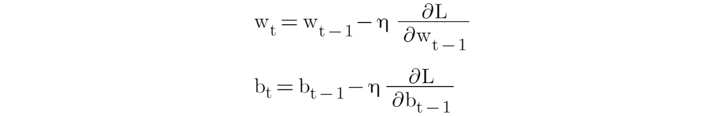

Stochastic Gradient Descent (SGD) is an iterative optimization algorithm
used to minimize the loss function (error) of a neural network by
adjusting the weights and biases of the network during training. Here\'s
how it works:

1\. \*\*Stochastic\*\*: In traditional Gradient Descent, you compute the
gradient of the loss with respect to all training examples, which can be
computationally expensive, especially for large datasets. In SGD, you
randomly select a small subset (mini-batch) of training examples
(typically 32, 64, or 128) at each iteration and update the model\'s
parameters based on the gradient of the loss computed for this
mini-batch.

2\. \*\*Gradient\*\*: The gradient is the direction of the steepest
increase in the loss function. SGD calculates the gradient of the loss
with respect to the model\'s parameters, indicating how to adjust the
parameters to minimize the loss.

3\. \*\*Descent\*\*: \"Descent\" indicates that the algorithm aims to
move in the direction opposite to the gradient. The goal is to find the
parameters that minimize the loss function, which is achieved by
iteratively adjusting the parameters in the direction of the negative
gradient.

SGD is preferred over batch gradient descent for several reasons:

\- \*\*Faster Convergence\*\*: Since SGD updates the model parameters
more frequently, it can converge faster, especially when dealing with
large datasets.

\- \*\*Regularization\*\*: The randomness introduced by using
mini-batches can act as a form of regularization, helping prevent
overfitting.

\- \*\*Parallelization\*\*: Mini-batch processing can be easily
parallelized, making it efficient for training on GPUs or distributed
systems.

\- \*\*Escape Local Minima\*\*: The stochastic nature of SGD can help
the algorithm escape local minima in the loss landscape.

In practice, variations of SGD are often used, such as momentum,
RMSprop, and Adam, to further enhance convergence and training
stability.

Sure, here are the equations for the Stochastic Gradient Descent (SGD)
algorithm. The goal of SGD is to minimize a loss function
\\(J(\\theta)\\) by updating the model parameters \\(\\theta\\)
iteratively. The parameters are typically weights and biases in the
context of training a neural network.

1\. \*\*Initialization\*\*: Initialize the model parameters
\\(\\theta\\) with some initial values.

2\. \*\*Choose a Learning Rate\*\*: Select a learning rate \\(\\alpha\\)
that determines the step size for parameter updates. The learning rate
is usually a small positive value.

3\. \*\*Iterative Updates\*\*:

For each iteration, do the following:

a\. \*\*Mini-Batch Sampling\*\*: Randomly select a mini-batch of
training examples from the dataset. Let this mini-batch be denoted as
\\(\\text{MiniBatch}\\).

b\. \*\*Compute the Gradient\*\*: Compute the gradient of the loss
function with respect to the parameters for the mini-batch. This is
often denoted as \\(\\nabla J(\\theta; \\text{MiniBatch})\\).

c\. \*\*Update Parameters\*\*: Update the model parameters using the
gradient information and the learning rate. The update equation is as
follows:

\\\[ \\theta \\leftarrow \\theta - \\alpha \\nabla J(\\theta;
\\text{MiniBatch}) \\\]

This update is performed for each parameter \\(\\theta_i\\) in
\\(\\theta\\), and the learning rate \\(\\alpha\\) controls the step
size in the direction of the negative gradient.

4\. \*\*Stopping Criteria\*\*: Repeat the iterative updates until a
stopping criterion is met. Common stopping criteria include a fixed
number of iterations, convergence of the loss, or other conditions based
on the specific problem.

The key equation in SGD is the parameter update step, which is
responsible for moving the parameters in the direction that reduces the
loss. The learning rate \\(\\alpha\\) determines the size of the step,
and the negative gradient \\(\\nabla J(\\theta; \\text{MiniBatch})\\)
indicates the direction of steepest descent in the loss landscape.

In practice, variations of SGD, like mini-batch size, learning rate
schedules, and momentum, are often used to improve convergence and
training efficiency.

Certainly! Here\'s a simple numerical example of Stochastic Gradient
Descent (SGD) to illustrate how it works. In this example, we\'ll
consider a linear regression problem, which is a straightforward case
for demonstration.

\*\*Problem\*\*: We want to fit a straight line to a set of data points
using SGD.

\*\*Linear Regression Model\*\*: The linear regression model has the
form \\(y = mx + b\\), where \\(m\\) is the slope and \\(b\\) is the
y-intercept. Our goal is to find the values of \\(m\\) and \\(b\\) that
best fit the data.

\*\*Loss Function\*\*: We\'ll use the mean squared error (MSE) as the
loss function to minimize:

\\\[J(m, b) = \\frac{1}{2N} \\sum\_{i=1}\^{N} (y_i - (mx_i + b))\^2\\\]

Where:

\- \\(N\\) is the number of data points.

\- \\(x_i\\) and \\(y_i\\) are the coordinates of the data points.

\*\*SGD Algorithm\*\*:

1\. Initialize \\(m\\) and \\(b\\) with some initial values, e.g., \\(m
= 0\\) and \\(b = 0\\).

2\. Choose a learning rate, e.g., \\(\\alpha = 0.01\\).

3\. Repeat for a fixed number of iterations or until convergence:

a\. Randomly select a data point from the dataset.

b\. Calculate the gradient of the loss with respect to \\(m\\) and
\\(b\\) for the selected data point.

\\\[

\\begin{align\*}

\\frac{\\partial J}{\\partial m} &= -(y_i - (mx_i + b))x_i \\\\

\\frac{\\partial J}{\\partial b} &= -(y_i - (mx_i + b))

\\end{align\*}

\\\]

c\. Update \\(m\\) and \\(b\\) using the gradients and the learning
rate:

\\\[

\\begin{align\*}

m &\\leftarrow m + \\alpha \\frac{\\partial J}{\\partial m} \\\\

b &\\leftarrow b + \\alpha \\frac{\\partial J}{\\partial b}

\\end{align\*}

\\\]

\*\*Sample Data\*\*:

Let\'s consider a dataset with three data points:

\`\`\`

Data point 1: (x1, y1) = (2, 3)

Data point 2: (x2, y2) = (4, 5)

Data point 3: (x3, y3) = (6, 7)

\`\`\`

\*\*SGD Steps\*\*:

Let\'s perform one iteration of SGD using the provided data and initial
values of \\(m\\) and \\(b\\). We\'ll use \\(\\alpha = 0.01\\).

1\. Initialize \\(m = 0\\) and \\(b = 0\\).

2\. Select a random data point (e.g., data point 2: \\(x2 = 4\\), \\(y2
= 5\\)).

3\. Compute the gradients:

\\\[

\\begin{align\*}

\\frac{\\partial J}{\\partial m} &= -(5 - (4m + b)) \\cdot 4 = -(5 - (4
\\cdot 0 + 0)) \\cdot 4 = -5 \\cdot 4 = -20 \\\\

\\frac{\\partial J}{\\partial b} &= -(5 - (4m + b)) = -(5 - (4 \\cdot
0 + 0)) = -5

\\end{align\*}

\\\]

4\. Update \\(m\\) and \\(b\\):

\\\[

\\begin{align\*}

m &\\leftarrow m + \\alpha \\frac{\\partial J}{\\partial m} = 0 + 0.01
\\cdot (-20) = -0.2 \\\\

b &\\leftarrow b + \\alpha \\frac{\\partial J}{\\partial b} = 0 + 0.01
\\cdot (-5) = -0.05

\\end{align\*}

\\\]

After this iteration, the values of \\(m\\) and \\(b\\) have been
updated. You would repeat these steps for a fixed number of iterations
or until convergence to find the best-fitting line for the given data
points.

**Drawbacks of base optimizer:(GD, SGD, mini-batch GD)**

-   Gradient Descent uses the whole training data to update weight and
    bias. Suppose if we have millions of records then training becomes
    slow and computationally very expensive.

-   SGD solved the Gradient Descent problem by using only single records
    to updates parameters. But, still, SGD is slow to converge because
    it needs forward and backward propagation for every record. And the
    path to reach global minima becomes very noisy.

-   Mini-batch GD overcomes the SDG drawbacks by using a batch of
    records to update the parameter. Since it doesn\'t use entire
    records to update parameter, the path to reach global minima is not
    as smooth as Gradient Descent.

{width="6.268055555555556in"
height="2.0243055555555554in"}

loss vs no. of the epoch

The above figure is the plot between the number of epoch on the x-axis
and the loss on the y-axis. We can clearly see that in Gradient Descent
the loss is reduced smoothly whereas in SGD there is a high oscillation
in loss value.

**Exponentially Weighted Averages** is used in sequential noisy data to
reduce the noise and smoothen the data. To denoise the data, we can use
the following equation to generate a new sequence of data with less
noise.

{width="6.268055555555556in" height="0.6875in"}

{width="6.268055555555556in"
height="1.7805555555555554in"}

Now, let's see how the new sequence is generated using the above
equation: For our example to make it simple, let's consider a sequence
of size 3.

{width="6.268055555555556in"
height="2.076388888888889in"}

Let's expand V3 equation:

{width="6.268055555555556in"
height="2.420138888888889in"}

From the above equation, at time step t=3 more weightage is given to
a3(which is the latest generated data) then followed by a2 previously
generated data, and so on. This is how the sequence of noisy data is
smoothened. It works better in a long sequence because, in the initial
period, the averaging effect is less due to fewer data points.

**1. SGD with momentum**

It always works better than the normal Stochastic Gradient Descent
Algorithm. The problem with SGD is that while it tries to reach minima
because of the high oscillation we can't increase the learning rate. So
it takes time to converge. In this algorithm, we will be using
Exponentially Weighted Averages to compute Gradient and used this
Gradient to update parameter.

-   An equation to update weights and bias in SGD

{width="6.268055555555556in"
height="1.0263888888888888in"}

-   An equation to update weights and bias in SGD with momentum

{width="6.268055555555556in"
height="1.6180555555555556in"}

In SGD with momentum, we have added momentum in a gradient function. By
this I mean the present Gradient is dependent on its previous Gradient
and so on. This accelerates SGD to converge faster and reduce the
oscillation.

{width="6.268055555555556in"
height="1.7805555555555554in"}

The above picture shows how the convergence happens in SGD with momentum
vs SGD without momentum.

**2. Adagrad (Adaptive Gradient Algorithm)**

Adagrad (Adaptive Gradient Algorithm) is an optimization algorithm that
is used to update the learning rate adaptively for each parameter during
the training of machine learning models, particularly in the context of
deep learning and neural networks. It was introduced by John Duchi, Elad
Hazan, and Yoram Singer in 2011.

Adagrad is designed to address two common challenges in gradient-based
optimization:

1\. \*\*Fixed Learning Rates\*\*: In traditional optimization algorithms
like stochastic gradient descent (SGD), a fixed learning rate is used
for all parameters throughout training. This can lead to slow
convergence or divergence, as it may not be the ideal learning rate for
all parameters.

2\. \*\*Sparse Features\*\*: In some machine learning tasks, certain
features or parameters are rarely updated because they are not
informative. Traditional optimizers may waste updates on these
parameters.

Adagrad tackles these challenges by adapting the learning rate for each
parameter individually based on their historical gradients.

{width="6.268055555555556in" height="6.61875in"}

{width="6.268055555555556in"
height="5.673611111111111in"}

{width="6.268055555555556in" height="6.19375in"}

Adagrad (Adaptive Gradient Algorithm) offers several advantages and
disadvantages, which are important to consider when deciding whether to
use it in training machine learning models, particularly deep neural
networks.

\*\*Advantages\*\*:

1\. \*\*Adaptive Learning Rates\*\*: Adagrad automatically adapts the
learning rate for each parameter based on the historical gradients. This
can be especially beneficial when dealing with sparse features or
parameters with different scales. It helps to converge effectively in
different directions in parameter space.

2\. \*\*Effective for Sparse Features\*\*: Adagrad is particularly
useful when working with sparse data, such as natural language
processing tasks, where many features are rarely active. It ensures that
parameters associated with active features receive appropriately scaled
updates.

3\. \*\*No Need for Manual Learning Rate Tuning\*\*: Unlike traditional
gradient descent, where you might need to manually tune the learning
rate, Adagrad eliminates the need for such tuning. It can provide
reasonable learning rates automatically.

\*\*Disadvantages\*\*:

1\. \*\*Accumulation of Historical Gradients\*\*: One major disadvantage
of Adagrad is that it accumulates the squared gradients in the
denominator over time. As a result, the learning rate can become
extremely small, which can lead to very slow convergence or a premature
halt in learning. This issue can be particularly problematic in deep
neural networks where the learning rates may become impractically small.

2\. \*\*Lack of Momentum\*\*: Adagrad does not include momentum, which
can help accelerate convergence and overcome local optima in
optimization landscapes. Momentum is a useful feature provided by other
optimization algorithms like RMSprop and Adam.

3\. \*\*Difficulty with Non-Convex Functions\*\*: Adagrad may struggle
with non-convex loss functions and high-curvature surfaces. Its adaptive
learning rates may not be ideal for rapidly changing landscapes.

4\. \*\*Memory Overhead\*\*: Storing and managing the historical
gradient sums for each parameter can result in significant memory
overhead, especially when dealing with a large number of parameters.

5\. \*\*Numerical Stability\*\*: The addition of a small constant
(\\(\\epsilon\\)) to prevent division by zero is essential for numerical
stability. However, the choice of \\(\\epsilon\\) can be somewhat
arbitrary and may need to be adjusted in practice.

6\. \*\*Variants with Improved Performance\*\*: Over time, variations of
Adagrad, such as RMSprop and Adam, have been developed to address some
of its limitations. These variants often provide better performance and
numerical stability.

In practice, Adagrad can be a useful optimization algorithm, especially
for small-scale tasks and when dealing with sparse data. However, for
deep neural networks and more complex optimization landscapes,
variations like RMSprop and Adam are often preferred due to their
improved performance and adaptive learning rate scheduling. The choice
of optimizer should be based on the specific problem and may require
experimentation to find the most effective algorithm.Adagrad adapts the
learning rate for each parameter based on the past gradients. Parameters
that have seen large gradients in the past will have smaller learning
rates, while parameters with smaller gradients will have larger learning
rates. This helps to converge faster in directions where the gradients
are steep and adapt more slowly in directions where the gradients are
shallow.

Advantages of Adagrad include its automatic learning rate adaptation and
ability to handle sparse features effectively. However, it has some
limitations, such as an ever-increasing denominator in the learning
rate, which can cause the learning rate to become very small over time,
making it less suitable for deep networks. Variations of Adagrad, such
as RMSprop and Adam, address some of these limitations by introducing
exponential moving averages and adaptive learning rate schedules.

Whatever the optimizer we learned till SGD with momentum, the learning
rate remains constant. In Adagrad optimizer, there is no momentum
concept so, it is much simpler compared to SGD with momentum.

The idea behind Adagrad is to use different learning rates for each
parameter base on iteration. The reason behind the need for different
learning rates is that the learning rate for sparse features parameters
needs to be higher compare to the dense features parameter because the
frequency of occurrence of sparse features is lower.

-   Equation:

{width="6.268055555555556in"
height="2.615972222222222in"}

In the above Adagrad optimizer equation, the learning rate has been
modified in such a way that it will automatically decrease because the
summation of the previous gradient square will always keep on increasing
after every time step. Now, let's take a simple example to check how the
learning rate is different for every parameter in a single time step.
For this example, we will consider a single neuron with 2 inputs and 1
output. So, the total number of parameters will be 3 including bias.

{width="6.268055555555556in"
height="2.2104166666666667in"}

The above computation is done at a single time step, where all the three
parameters learning rate "η" is divided by the square root of "α" which
is different for all parameters. So, we can see that the learning rate
is different for all three parameters.

Now, let's see how weights and bias are updated in Stochastic Gradient
Descent.

{width="6.268055555555556in"
height="2.220138888888889in"}

Similarly, the above computation is done at a single time step, and here
the learning rate "η" remains the same for all parameters.

Lastly, despite not having to manually tune the learning rate there is
one huge disadvantage i.e due to monotonically decreasing learning
rates, at some point in time step, the model will stop learning as the
learning rate is almost close to 0.
