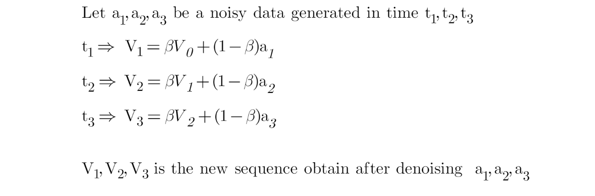
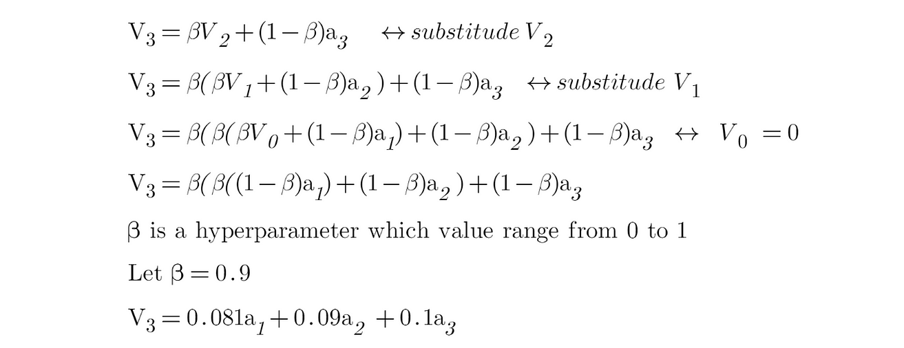
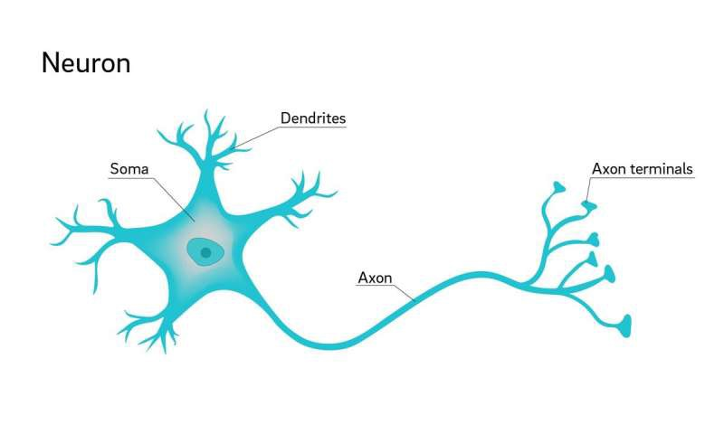
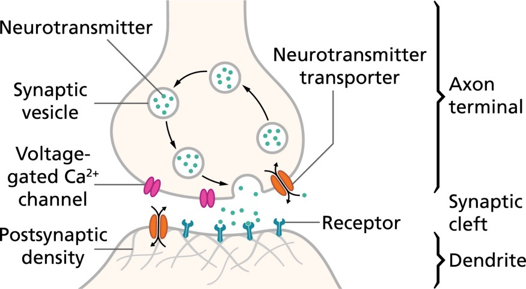

{width="6.268055555555556in"
height="1.871794619422572in"}

{width="6.266911636045494in"
height="3.743589238845144in"}

Limitations of machine learning models include:

1.  Machine learning models are often opaque, making it difficult to
    understand why a particular prediction was made.

2.  Machine learning models are often unstable, meaning that they can
    produce different results when trained on different data sets.

3.  Machine learning models are often biased, meaning that they can
    produce inaccurate results when applied to data sets that don't
    match the data set on which the model was trained.

4.  Machine learning models are often difficult to customize, meaning
    that it can be hard to change their parameters or to adapt them to
    new data sets.

5.  Machine learning models are often expensive to train, meaning that
    it can take a lot of time and computational resources to build a
    model that is accurate.

6.  Machine learning models are often vulnerable to learning from noise
    in the data, which can lead to inaccurate predictions.

7.  Machine learning models are often sensitive to the order in which
    the data is presented to them, meaning that they can produce
    different results if the data is rearranged.

8.  Machine learning models are often sensitive to the scale of the
    data, meaning that they can produce different results if the data is
    aggregated or disaggregated.

9.  Machine learning models are often sensitive to the distribution of
    the data, meaning that they can produce different results if the
    data is sorted in a different way.

10. Machine learning models are often sensitive to the selection of
    training data, meaning that the results of the model can be biased
    if the training data is not representative of the data set that will
    be used to make predictions.

Deep learning is a subset of machine learning that involves the use of
artificial neural networks with many layers (hence \"deep\") to model
and understand complex patterns in data. These neural networks are
inspired by the structure and function of the human brain.

{width="5.730555555555555in"
height="4.166666666666667in"}

Now, the value of Y can be anything ranging from -inf to +inf. The
neuron really doesn't know the bounds of the value. So how do we decide
whether the neuron should fire or not (why this firing pattern? Because
we learned it from biology that's the way brain works and the brain is a
working testimony of an awesome and intelligent system).

We decided to add "activation functions" for this purpose. To check the
Y value produced by a neuron and decide whether outside connections
should consider this neuron as "fired" or not. Or rather let's
say --- "activated" or not.

These are also known as mapping functions. They take some input on the
x-axis and output a value in a restricted range(mostly). They are used
to convert large outputs from the units into a smaller value most of the
time and promote non-linearity in your NN. Your choice of an activation
function can drastically improve or hinder the performance of your NN.
You can choose different activation functions for different units if
you like.

Now let's take a simple example:

The first thing that comes to our minds is how about a threshold-based
activation function? If the value of Y is above a certain value, declare
it activated. If it's less than the threshold, then say it's not. Hmm
great. This could work!

Activation function A = "activated" if Y \> threshold else not

Alternatively, A = 1 if y\> threshold, 0 otherwise

Well, what we just did is a "step function", see the below figure.

{width="3.3847222222222224in"
height="2.5381944444444446in"}

Step Activation Function

Its output is 1 (activated) when value \> 0 (threshold) and outputs a 0
(not activated) otherwise. Great. So, this makes an activation function
for a neuron.

{width="4.583333333333333in"
height="0.9805555555555555in"}

A neuron is a nerve cell in your brain and body that helps send and
receive information. Think of it like a tiny messenger that carries
messages from one part of your body to another. The main part of the
neuron is called the soma or cell body. It contains the cell's nucleus,
where DNA lives, and other parts that keep the neuron alive and
functioning. Extending from the soma are branch-like structures called
dendrites, which receive messages from other neurons. A long, thin
extension from the soma is called the axon, which sends messages away
from the soma to other neurons or muscles. At the end of the axon are
the axon terminals, which release chemicals to pass the message to the
next neuron. When a neuron wants to communicate, it generates an
electrical signal called a "spike" that travels down the axon to the
axon terminals. At the axon terminal, the spike triggers the release of
chemicals called neurotransmitters, which cross a tiny gap called a
synapse and reach the next neuron's dendrites. The neurotransmitters
bind to receptors on the dendrites of the next neuron, starting another
electrical signal in that neuron. This new signal can lead to further
messages being sent. Excitatory signals make the receiving neuron more
likely to send its own message, while inhibitory signals make it less
likely to send a message. In deep learning, to model neurons, we use
concepts like rate-coding, which refers to the rate or frequency of
spikes and is similar to how often a neuron in a neural network
activates or fires. Synaptic strength is another concept, representing
the effectiveness of the connection between neurons and is analogous to
the weights in a neural network that adjust how strongly one neuron
affects another. Excitatory and inhibitory transmission refers to how
neurons can either increase or decrease the likelihood of the next
neuron firing, similar to positive or negative impacts on the output of
a neuron in deep learning models. In summary, the process of sending and
receiving information involves a neuron sending an electrical signal
down its axon, crossing the synapse with neurotransmitters, and
receiving information through the next neuron's dendrites. This process
allows neurons to work together to perform the tasks your brain and body
need to function.

{width="6.268055555555556in"
height="3.7576388888888888in"}

{width="6.268055555555556in" height="3.45625in"}

**Mathematics in Biological Neurons**

In biological neurons, the main math concepts are:

1\. Action Potentials: Neurons send messages using electrical signals
called action potentials. The math for this involves equations that
describe how these electrical signals move and change over time. For
example:

Change in Voltage = Electrical Currents - External Input

This means that the voltage across the neuron\'s membrane changes based
on the currents moving through it and any external inputs. A detailed
model like the Hodgkin-Huxley model uses complex equations, but the main
idea is that electrical signals travel along the neuron.

2\. Synaptic Transmission: When a neuron sends a message, it releases
chemicals called neurotransmitters. The math for this involves
calculating how these chemicals cross a gap between neurons (called a
synapse) and affect the next neuron. For example:

Signal Strength = Neurotransmitter Release × Receptor Response

This means the strength of the signal between neurons depends on how
many neurotransmitters are released and how the receptors on the next
neuron respond to them.

3\. Rate Coding: Neurons send information based on the rate at which
they fire spikes (how often they produce electrical signals). The math
for this is:

Firing Rate = Number of Spikes / Time

This calculation helps show how much information a neuron is sending by
measuring how many spikes it produces over a certain period.

Weights and Biases in Neural Networks

In neural networks, weights and biases are fundamental components.
Here's a simple explanation of what they are and why we use them:

1\. Weight

Weight is a number that determines how important a particular input is
in making a decision in a neural network. It adjusts the influence of
each input.

\- Simple Explanation: Think of weight as a dial that changes how much
each input affects the output.

\- Mathematical Equation: If \`x\` is the input and \`w\` is the weight,
then the weighted input is:

Weighted Input = x × w

\- Example: If taste has a weight of 0.7 and healthiness has a weight of
0.3, then taste affects your decision more.

2\. Bias

Bias is a number that helps adjust the output of the neuron. It shifts
the activation function to make the model more flexible and fit the data
better.

\- Simple Explanation: Think of bias as an extra factor that shifts the
outcome of a decision. It allows the model to make decisions even if
inputs are zero or similar.

\- Mathematical Equation: If \`Weighted Input\` is the input after
weights, and \`b\` is the bias, the calculation is:

Output = (Weighted Input + b)

\- Example: If you always prefer more taste in your food, bias will
represent this extra preference.

3\. Why We Use Weights and Biases

\- Weights: Adjust the importance of each input to improve model
predictions.

\- Bias: Shifts the decision boundary to help fit the model better to
the data.

\- Combined Equation: For a neuron, the output can be expressed as:

Output = (Input1 × Weight1 + Input2 × Weight2 + \... + Inputn ×
Weightn) + Bias

\- Activation Function: After calculating the weighted sum plus bias, an
activation function determines if the neuron should be activated.

Common Activation Functions:

\- Sigmoid:

Output = 1 / (1 + e\^(-(Weighted Sum + Bias)))

\- ReLU (Rectified Linear Unit):

Output = max(0, Weighted Sum + Bias)

\- Why Use These Functions?

\- Weights: Determine how much influence each input has.

\- Bias: Allows the model to fit the data better.

\- Activation Functions: Decide if the neuron should activate based on
the weighted sum plus bias.

4\. Simple Example

Suppose you have a model to decide if you will enjoy a movie based on
two features: Action and Comedy.

\- Action = 0.8

\- Comedy = 0.5

\- Weight for Action = 1.5

\- Weight for Comedy = 1.2

\- Bias = -1.0

Calculate the Weighted Sum:

Weighted Sum = (0.8 × 1.5) + (0.5 × 1.2) = 1.2 + 0.6 = 1.8

Add the Bias:

Weighted Sum + Bias = 1.8 - 1.0 = 0.8

Apply Activation Function (ReLU):

Output = max(0, 0.8) = 0.8

If you are using a threshold to decide enjoyment, this output might help
you make that decision.

6\. Simple Analogies

\- Weight: Like how much you value each part of a decision. Example: If
you think taste matters more in food, you give it a higher weight.

\- Bias: Like a starting point or extra consideration. Example: If you
always like extra taste, that's your bias.

\- Activation Function: Like deciding if you should act on something
based on your decision. Example: Deciding to eat the food based on taste
and healthiness.

***A Neural Network without an activation function is basically a linear
regression model in Deep Learning, since these functions perform
non-linear computations on the input of a Neural Network, enabling it to
learn and do more complex tasks***. 

{width="5.228069772528434in"
height="2.5393405511811022in"}thought of as analogous to the role of a

***Without an activation function, a Neural Network is just a linear
regression model***. The activation function transforms the input in a
non-linear way, allowing it to learn and as well as accomplish more
complex tasks.

## Activation Functions

An [activation
function](https://en.wikipedia.org/wiki/Activation_function) in a neural
network defines how the weighted sum of the input is transformed into an
output from a node or nodes in a layer of the network.

Sometimes the activation function is called a "*transfer function*." If
the output range of the activation function is limited, then it may be
called a "*squashing function*." Many activation functions are nonlinear
and may be referred to as the "*nonlinearity*" in the layer or the
network design.

The choice of activation function has a large impact on the capability
and performance of the neural network, and different activation
functions may be used in different parts of the model.

Technically, the activation function is used within or after the
internal processing of each node in the network, although networks are
designed to use the same activation function for all nodes in a layer.

A network may have three types of layers: input layers that take raw
input from the domain, **hidden layers** that take input from another
layer and pass output to another layer, and **output layers** that make
a prediction.

All hidden layers typically use the same activation function. The output
layer will typically use a different activation function from the hidden
layers and is dependent upon the type of prediction required by the
model.

Activation functions are also typically differentiable, meaning the
first-order derivative can be calculated for a given input value. This
is required given that neural networks are typically trained using the
backpropagation of error algorithm that requires the derivative of
prediction error in order to update the weights of the model.

Gradient Descent Algorithm **iteratively calculates the next point using
gradient at the current position, scales it (by a learning rate) and
subtracts obtained value from the current position (makes a step)**. It
subtracts the value because we want to minimise the function (to
maximise it would be adding).

Backpropagation, short for \"backward propagation of errors,\" is **an
algorithm for supervised learning of artificial neural networks using
gradient descent**. Given an artificial neural network and an error
function, the method calculates the gradient of the error function with
respect to the neural network\'s weights.

There are many different types of activation functions used in neural
networks, although perhaps only a small number of functions used in
practice for hidden and output layers.

## Activation for Hidden Layers

A hidden layer in a neural network is a layer that receives input from
another layer (such as another hidden layer or an input layer) and
provides output to another layer (such as another hidden layer or an
output layer).

A hidden layer does not directly contact input data or produce outputs
for a model, at least in general.

A neural network may have zero or more hidden layers.

Typically, a differentiable nonlinear activation function is used in the
hidden layers of a neural network. This allows the model to learn more
complex functions than a network trained using a linear activation
function.

*In order to get access to a much richer hypothesis space that would
benefit from deep representations, you need a non-linearity, or
activation function.*

There are perhaps three activation functions you may want to consider
for use in hidden layers; they are:

-   Rectified Linear Activation (**ReLU**)

-   Logistic (**Sigmoid**)

-   Hyperbolic Tangent (**Tanh**)

This is not an exhaustive list of activation functions used for hidden
layers, but they are the most commonly used.

### ReLU Hidden Layer Activation Function

The [rectified linear activation
function](https://machinelearningmastery.com/rectified-linear-activation-function-for-deep-learning-neural-networks/),
or ReLU activation function, is perhaps the most common function used
for hidden layers.

It is common because it is both simple to implement and effective at
overcoming the limitations of other previously popular activation
functions, such as Sigmoid and Tanh. Specifically, it is less
susceptible to [vanishing
gradients](https://machinelearningmastery.com/how-to-fix-vanishing-gradients-using-the-rectified-linear-activation-function/) that
prevent deep models from being trained, although it can suffer from
other problems like saturated or "*dead*" units.

The ReLU function is calculated as follows:

-   max(0.0, x)

This means that if the input value (x) is negative, then a value 0.0 is
returned, otherwise, the value is returned.

{width="6.268055555555556in"
height="4.701388888888889in"}

When using the ReLU function for hidden layers, it is a good practice to
use a "*He Normal*" or "*He Uniform*" weight initialization and scale
input data to the range 0-1 (normalize) prior to training.

### Sigmoid Hidden Layer Activation Function

The sigmoid activation function is also called the logistic function.

It is the same function used in the logistic regression classification
algorithm.

The function takes any real value as input and outputs values in the
range 0 to 1. The larger the input (more positive), the closer the
output value will be to 1.0, whereas the smaller the input (more
negative), the closer the output will be to 0.0.

The sigmoid activation function is calculated as follows:

-   1.0 / (1.0 + e\^-x)

Where [e is a mathematical
constant](https://en.wikipedia.org/wiki/E_(mathematical_constant)),
which is the base of the natural logarithm.

We can see the familiar S-shape of the sigmoid activation function.

{width="6.268055555555556in"
height="4.701388888888889in"}

Plot of Inputs vs. Outputs for the Sigmoid Activation Function.

When using the Sigmoid function for hidden layers, it is a good practice
to use a "*Xavier Normal*" or "*Xavier Uniform*" weight initialization
(also referred to Glorot initialization, named for [Xavier
Glorot](https://www.linkedin.com/in/xglorot/)) and scale input data to
the range 0-1 (e.g. the range of the activation function) prior to
training.

### Tanh Hidden Layer Activation Function

The hyperbolic tangent activation function is also referred to simply as
the Tanh (also "*tanh*" and "*TanH*") function.

It is very similar to the sigmoid activation function and even has the
same S-shape.

The function takes any real value as input and outputs values in the
range -1 to 1. The larger the input (more positive), the closer the
output value will be to 1.0, whereas the smaller the input (more
negative), the closer the output will be to -1.0.

The Tanh activation function is calculated as follows:

-   (e\^x -- e\^-x) / (e\^x + e\^-x)

Where [e is a mathematical
constant](https://en.wikipedia.org/wiki/E_(mathematical_constant)) that
is the base of the natural logarithm.

We can see the familiar S-shape of the Tanh activation function.

{width="6.268055555555556in"
height="4.701388888888889in"}

Plot of Inputs vs. Outputs for the Tanh Activation Function.

When using the TanH function for hidden layers, it is a good practice to
use a "*Xavier Normal*" or "*Xavier Uniform*" weight initialization
(also referred to Glorot initialization, named for Xavier Glorot) and
scale input data to the range -1 to 1 (e.g. the range of the activation
function) prior to training.

### How to Choose a Hidden Layer Activation Function

A neural network will almost always have the same activation function in
all hidden layers.

It is most unusual to vary the activation function through a network
model.

Traditionally, the sigmoid activation function was the default
activation function in the 1990s. Perhaps through the mid to late 1990s
to 2010s, the Tanh function was the default activation function for
hidden layers.

Both the sigmoid and Tanh functions can make the model more susceptible
to problems during training, via the so-called vanishing gradients
problem.

The activation function used in hidden layers is typically chosen based
on the type of neural network architecture.

Modern neural network models with common architectures, such as MLP and
CNN, will make use of the ReLU activation function, or extensions.

Recurrent networks still commonly use Tanh or sigmoid activation
functions, or even both. For example, the LSTM commonly uses the Sigmoid
activation for recurrent connections and the Tanh activation for output.

-   **Multilayer Perceptron (MLP)**: ReLU activation function.

-   **Convolutional Neural Network (CNN)**: ReLU activation function.

-   **Recurrent Neural Network**: Tanh and/or Sigmoid activation
    function.

-   

{width="5.429825021872266in"
height="2.6534481627296587in"}

How to Choose a Hidden Layer Activation Function

## Activation for Output Layers

The output layer is the layer in a neural network model that directly
outputs a prediction.

All feed-forward neural network models have an output layer.

Feed forward neural networks are **artificial neural networks in which
nodes do not form loops**. This type of neural network is also known as
a multi-layer neural network as all information is only passed forward.
During data flow, input nodes receive data, which travel through hidden
layers, and exit output nodes.

There are perhaps three activation functions you may want to consider
for use in the output layer; they are:

-   Linear

-   Logistic (Sigmoid)

-   Softmax

This is not an exhaustive list of activation functions used for output
layers, but they are the most commonly used.

### Linear Output Activation Function

The linear activation function is also called "*identity*" (multiplied
by 1.0) or "*no activation*."

This is because the linear activation function does not change the
weighted sum of the input in any way and instead returns the value
directly.

### Sigmoid Output Activation Function

The sigmoid of logistic activation function was described above.

### Softmax Output Activation Function

### Max(2,3) = 3

### A = \[2,3\]

### A\[0\] = 2

### A\[1\] = 3

### Argmax(2,3) = 0 , 1

The [softmax
function](https://machinelearningmastery.com/softmax-activation-function-with-python/) outputs
a vector of values that sum to 1.0 that can be interpreted as
probabilities of class membership.

It is related to the [argmax
function](https://machinelearningmastery.com/argmax-in-machine-learning/) that
outputs a 0 for all options and 1 for the chosen option. Softmax is a
"*softer*" version of argmax that allows a probability-like output of a
winner-take-all function.

As such, the input to the function is a vector of real values and the
output is a vector of the same length with values that sum to 1.0 like
probabilities.

The softmax function is calculated as follows:

-   e\^x / sum(e\^x)

Where *x* is a vector of outputs and [e is a mathematical
constant](https://en.wikipedia.org/wiki/E_(mathematical_constant)) that
is the base of the natural logarithm.

Target labels used to train a model with the softmax activation function
in the output layer will be vectors with 1 for the target class and 0
for all other classes.

**How to Choose an Output Activation Function**

You must choose the activation function for your output layer based on
the type of prediction problem that you are solving.

Specifically, the type of variable that is being predicted.

For example, you may divide prediction problems into two main groups,
predicting a categorical variable (*classification*) and predicting a
numerical variable (*regression*).

If your problem is a regression problem, you should use a linear
activation function.

-   **Regression**: One node, linear activation.

If your problem is a classification problem, then there are three main
types of classification problems and each may use a different activation
function.

Predicting a probability is not a regression problem; it is
classification. In all cases of classification, your model will predict
the probability of class membership (e.g. probability that an example
belongs to each class) that you can convert to a crisp class label by
rounding (for sigmoid) or argmax (for softmax).

If there are two mutually exclusive classes (binary classification),
then your output layer will have one node and a sigmoid activation
function should be used. If there are more than two mutually exclusive
classes (multiclass classification), then your output layer will have
one node per class and a softmax activation should be used. If there are
two or more mutually inclusive classes (multilabel classification), then
your output layer will have one node for each class and a sigmoid
activation function is used.

-   **Binary Classification**: One node, sigmoid activation.

-   **Multiclass Classification**: One node per class, softmax
    activation.

-   **Multilabel Classification**: One node per class, sigmoid
    activation.

The figure below summarizes how to choose an activation function for the
output layer of your neural network model.

{width="5.438194444444444in"
height="3.2324562554680667in"}
