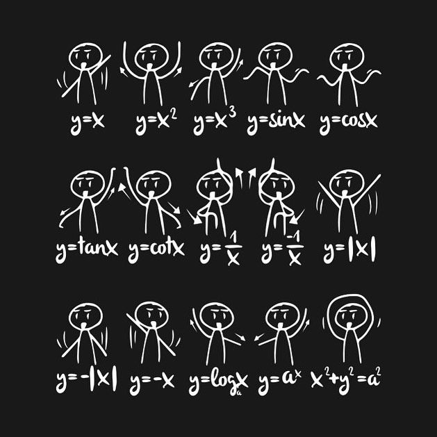

Calculus plays an important role in data science and machine learning.
Some of the most important concepts in calculus that are used in these
fields include:

Derivatives: The derivative of a function measures the rate of change of
the function with respect to its input variables. In machine learning,
derivatives are used to find the optimal values of model parameters that
minimize a loss function.

Integration: Integration is the opposite of differentiation, and it is
used to calculate the area under a curve. In machine learning,
integration is used to calculate probabilities and perform various types
of data transformations.

Partial derivatives: A partial derivative measures the rate of change of
a function with respect to one of its input variables, holding all other
variables constant. In machine learning, partial derivatives are used to
calculate gradients and perform optimization algorithms such as
stochastic gradient descent.

Chain rule: The chain rule is a formula for computing the derivative of
a composite function. In machine learning, the chain rule is used to
compute gradients for neural networks and other types of models.

Taylor series: The Taylor series is a way to represent a function as an
infinite sum of terms. In machine learning, Taylor series expansions are
used to approximate functions and calculate gradients.

Convex optimization: Convex optimization is the process of finding the
minimum value of a convex function over a convex set. In machine
learning, many optimization problems are convex, and convex optimization
algorithms are used to find the optimal values of model parameters.

Overall, calculus is an important foundation for understanding the
mathematical concepts and techniques used in data science and machine
learning.

Differential calculus is a branch of calculus that deals with the study
of rates of change and slopes of curves. It is concerned with the
properties of functions and their derivatives, which measure how much
the function changes as its input variables change.

The fundamental concept in differential calculus is the derivative,
which is defined as the limit of the ratio of the change in a function
to the change in its input variables. In other words, the derivative of
a function f(x) with respect to its input variable x is the slope of the
tangent line to the curve of f(x) at a given point.

For example, consider the function f(x) = x\^2. The derivative of this
function with respect to x is given by:

f\'(x) = lim(h-\>0) \[f(x+h) - f(x)\]/h = lim(h-\>0) \[(x+h)\^2 -
x\^2\]/h = lim(h-\>0) \[2x + h\] = 2x

This means that the slope of the tangent line to the curve of f(x) at
any point is given by 2x. For example, at x = 2, the slope of the
tangent line is 4.

Another example of differential calculus is the calculation of the
maximum or minimum points of a function. These points occur when the
derivative of the function is equal to zero or does not exist. For
example, consider the function g(x) = x\^3 - 6x\^2 + 9x + 2. To find the
maximum and minimum points of this function, we need to find its
derivative:

g\'(x) = 3x\^2 - 12x + 9

Setting this derivative equal to zero and solving for x, we get:

3x\^2 - 12x + 9 = 0 x\^2 - 4x + 3 = 0 (x - 3)(x - 1) = 0

This means that the maximum and minimum points occur at x = 1 and x = 3.
To determine whether these are maximum or minimum points, we need to
look at the second derivative:

g\'\'(x) = 6x - 12

At x = 1, g\'\'(1) = -6, which means that this point is a local maximum.
At x = 3, g\'\'(3) = 6, which means that this point is a local minimum.

In summary, differential calculus is a powerful tool for analyzing the
behavior of functions and finding critical points such as maximum and
minimum points. It has many practical applications in fields such as
physics, engineering, economics, and finance, as well as in machine
learning and data science.

Introduction:

Integral calculus is an important branch of mathematics that deals with
the calculation of integrals and finding the area under a curve. It has
a wide range of applications in various fields, including data science
and machine learning. In data science and machine learning, integral
calculus is used for tasks such as calculating probabilities, optimizing
functions, and analyzing data.

Formulae:

The most basic formula in integral calculus is the definite integral:

∫\_a\^b f(x) dx

which represents the area under the curve of f(x) between the values of
x=a and x=b. The indefinite integral is another important formula in
integral calculus:

∫ f(x) dx

which represents the antiderivative of the function f(x).

There are many other important formulas in integral calculus, such as
the substitution rule, integration by parts, and trigonometric
substitutions. These formulas are used to solve more complex integration
problems.

Examples:

Here are a few examples of how integral calculus is used in data science
and machine learning:

Probability density functions: In probability theory, the probability
density function (PDF) of a continuous random variable can be defined as
the derivative of its cumulative distribution function (CDF).
Integrating the PDF over a given range gives the probability of the
variable falling within that range.

Optimization: Many machine learning algorithms involve optimizing a cost
function, which is a function that measures how well the algorithm is
performing. Integral calculus can be used to find the minimum or maximum
value of the cost function, which corresponds to the optimal solution.

Signal processing: In signal processing, the Fourier transform is a
mathematical tool that converts a time-domain signal into a
frequency-domain signal. The Fourier transform is essentially an
integral, and its properties can be analyzed using integral calculus.

Regression analysis: In regression analysis, the goal is to fit a curve
to a set of data points. Integral calculus can be used to calculate the
best fit curve by minimizing the sum of the squared differences between
the data points and the curve. This is known as the method of least
squares.

Bayesian inference: Bayesian inference is a statistical technique for
updating probabilities based on new data. Integral calculus is used to
calculate the marginal likelihood, which is the probability of the data
given the model parameters. This calculation is essential for Bayesian
inference.

Sure, here are a few examples of integrals:

∫ x\^2 dx = (1/3) x\^3 + C, where C is the constant of integration.

This is a simple example of an indefinite integral, which represents the
antiderivative of the function f(x) = x\^2.

∫ 2x dx = x\^2 + C, where C is the constant of integration.

This is another simple example of an indefinite integral. The function
f(x) = 2x is a straight line with slope 2, so its antiderivative is a
parabolic curve with slope 2x.

∫ (2x + 1) dx = x\^2 + x + C, where C is the constant of integration.

This is an example of a linear combination of functions. The
antiderivative of 2x is x\^2, and the antiderivative of 1 is x, so the
antiderivative of (2x + 1) is the sum of their antiderivatives.

∫ e\^x dx = e\^x + C, where C is the constant of integration.

This is an example of an exponential function. The antiderivative of
e\^x is itself, so the integral of e\^x is simply e\^x.

∫ sin(x) dx = -cos(x) + C, where C is the constant of integration.

This is an example of a trigonometric function. The antiderivative of
sin(x) is -cos(x), so the integral of sin(x) is -cos(x) plus a constant.

∫ 1/x dx = ln(x) + C, where C is the constant of integration.

This is an example of a logarithmic function. The antiderivative of 1/x
is ln(x), so the integral of 1/x is ln(x) plus a constant.

∫ (x\^3 - 3x\^2 + 5x - 7) dx = (1/4) x\^4 - x\^3 + (5/2) x\^2 - 7x + C,
where C is the constant of integration.

This is an example of a polynomial function. The antiderivative of each
term is found by raising the exponent by 1 and dividing by the new
exponent, so the integral of the polynomial is the sum of the integrals
of its individual terms.

Math is quite daunting, especially for folks coming from a non-technical
background. There are plenty of things you can easily get confused with
and then lose motivation. But despite its complexity, math is an
integral condition to manipulate data effectively. Ignoring it is the
worst sin you can ever do.

**Functions, Multivariable Calculus & Graphs**

**#1 Functions**

{width="6.268055555555556in"
height="5.754385389326334in"}

**Functions in a nutshell**

Functions are basic stuff needed for data science. **"f(x) = ... "** is
the classic way of writing a function. It is like a machine that has an
input and an output, and these two things are related. A function takes
elements from a set (the domain) and relates them to elements in a set
(the codomain). Every function can be presented as a graph.

What is important to focus on for data science are "periodic functions"
and "exponential decay." A periodic function is a function that repeats
its values at regular intervals. Exponential decay, in turn, describes
the process of reducing an amount by a consistent percentage rate over a
period of time.

Other than that, it is important to know how recurrence equations work.
A recurrence relation is an equation that recursively defines a sequence
or multidimensional array of values, once one or more initial terms are
given; each further term of the sequence or array is defined as a
function of the preceding terms.

**Why you need Functions in Data Science?**

You don't have to memorize all functions, all of them are presented in
libraries and frameworks. You just need to understand how they work and
for what. For instance, periodic functions and exponential decay are
often used to analyze a time series. Logarithms and recurrence equations
are needed to understand binary search and how a search runs faster on a
million-item database after you've sorted it.

**#2 Multivariable Calculus**

{width="6.268055555555556in"
height="4.165277777777778in"}

**Multivariable Calculus in a nutshell**

Multivariable Calculus is a whole branch of math that covers functions,
derivatives, integrals, and limits. It is divided into two types called
Differential Statistics and Inferential Statistics.

Differential Calculus splits the given data into small pieces to know
how it changes.

{width="6.268055555555556in"
height="0.3958333333333333in"}

Inferential Calculus combines (joins) the small pieces to find how much
there is.

{width="6.268055555555556in"
height="0.3958333333333333in"}

You'll need to be able to calculate derivatives and gradients for
optimization. By the way, one of the most common optimization techniques
is gradient descent.

Gradient Descent is an optimization algorithm for finding a local
minimum of a differentiable function. Gradient descent subtracts the
step size from the current value of intercept to get the new value of
intercept.

**Why you need Multivariable Calculus in Data Science?**

You need to know some basic calculus in order to understand how
functions change over time (derivatives) and to calculate the total
amount of a quantity that accumulates over a time period (integrals).

Other than that, Data Scientists mainly use calculus in building much
Deep Learning and Machine Learning Models. They are involved in
optimizing the data and bringing out better outputs of data, by drawing
intelligent insights hidden in them.
