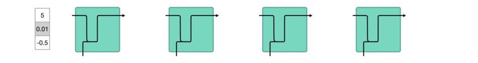
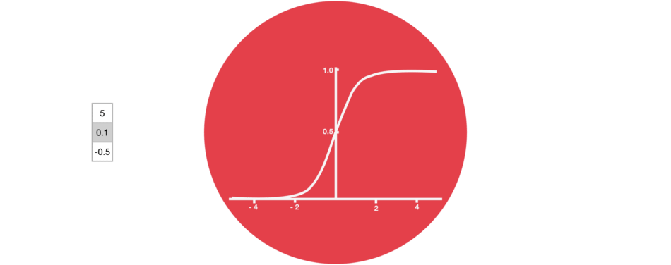

[Machine Learning](https://towardsai.net/p/category/machine-learning)

Introduction to Neural Networks and Their Key Elements
(Part-C) --- Activation Functions & Layers

{width="5.730555555555555in"
height="4.166666666666667in"}

In the[ previous story we have learned about some of the hyper
parameters](https://medium.com/towards-artificial-intelligence/introduction-to-neural-networks-and-their-key-elements-part-b-hyper-parameters-71f50958b7fc) of
an Artificial Neural Network. Today we'll talk about activation
functions and Layers, which some people may consider them
hyper-parameters and some not.

So let's begin today\'s story.

To understand about activation function first we need to recall
the [artificial
neuron](https://medium.com/towards-artificial-intelligence/deep-learning-series-chapter-2-part-a-18f742260e2a).
So what does an artificial neuron do? Simply put, it calculates a
"weighted sum" of its input, adds a bias and then decides whether it
should be "fired" (activated) or not ( yeah right, an activation
function does this, but let's go with the flow for a moment ).

So consider a neuron.

{width="4.583333333333333in"
height="0.9805555555555555in"}

Now, the value of Y can be anything ranging from -inf to +inf. The
neuron really doesn't know the bounds of the value. So how do we decide
whether the neuron should fire or not ( why this firing pattern? Because
we learned it from biology that's the way brain works and the brain is a
working testimony of an awesome and intelligent system ).

We decided to add "activation functions" for this purpose. To check the
Y value produced by a neuron and decide whether outside connections
should consider this neuron as "fired" or not. Or rather let's
say --- "activated" or not.

These are also known as mapping functions. They take some input on the
x-axis and output a value in a restricted range(mostly). They are used
to convert large outputs from the units into a smaller value most of the
time and promote non-linearity in your NN. Your choice of an activation
function can drastically improve or hinder the performance of your NN.
You can choose different activation functions for different units if
you like.

Now let's take a simple example:

The first thing that comes to our minds is how about a threshold-based
activation function? If the value of Y is above a certain value, declare
it activated. If it's less than the threshold, then say it's not. Hmm
great. This could work!

Activation function A = "activated" if Y \> threshold else not

Alternatively, A = 1 if y\> threshold, 0 otherwise

Well, what we just did is a "step function", see the below figure.

{width="3.3847222222222224in"
height="2.5381944444444446in"}

Step Activation Function

Its output is 1 ( activated) when value \> 0 (threshold) and outputs a 0
( not activated) otherwise. Great. So this makes an activation function
for a neuron.

Now lets talk about more realistic or most used activation functions
in [Deep Learning](https://towardsai.net/ai/deep-learning) practices.

1.1. tanh Activation Function:

The tanh activation is used to help regulate the values flowing through
the network. The tanh function squishes values to always be between -1
and 1.

The tanh activation is used to help regulate the values flowing through
the network. The tanh function squishes values to always be between -1
and 1.

{width="6.268055555555556in"
height="2.4805555555555556in"}Tanh activation function

When vectors are flowing through a neural network, it undergoes many
transformations due to various math operations. So imagine a value that
continues to be multiplied by let's say ***3***. You can see how some
values can explode and become astronomical, causing other values to seem
insignificant.

{width="6.2668383639545056in"
height="1.0984853455818022in"}Vector transformation without tanh

A tanh function ensures that the values stay between -1 and 1, thus
regulating the output of the neural network. You can see how the same
values from above remain between the boundaries allowed by the tanh
function.

{width="6.268055555555556in"
height="1.0303029308836396in"}Vector transformation with tanh

1.2. Sigmoid Activation Function:

A sigmoid activation is similar to the tanh activation. Instead of
squishing values between -1 and 1, it squishes values between 0 and 1.
That is helpful to update data because any number getting multiplied by
0 is 0, causing values to disappears or be "forgotten." Any number
multiplied by 1 is the same value therefore that value stay's the same
or is "kept." The network can learn which data is not important
therefore can be forgotten or which data is important to keep. The
neurons which have values near to zero will have less impact and the
neurons which produces values near to 1 will have more impact.

{width="6.268055555555556in"
height="2.4805555555555556in"}Sigmoid Activation Function

Sigmoid, is mostly used in output neurons in case of binary
classification problem to convert the incoming signal into a range of 0
to 1 so that it can be interpreted as a probability.

Do not mix the sigmoid with softmax because in sigmoid all the neurons
have values between 0 and 1 and it is possible that the sum of the
values of all neurons may not be equal to 1.

1.3. Softmax Activation Function:

Softmax function comes from the family of Sigmoid functions only.
Softmax is a wonderful activation function that turns numbers often
known as logits into probabilities that sum to one. Softmax function
outputs a vector that represents the probability distributions of a list
of potential outcomes.

{width="6.268055555555556in"
height="2.6993055555555556in"}Softmax in action

Softmax function squashes the incoming signals for multiple classes in
a [probability
distribution](https://towardsai.net/p/statistics/bernoulli-distribution-probability-tutorial-with-python-90061ee078a).
The sum of this [probability
distribution](https://towardsai.net/p/statistics/bernoulli-distribution-probability-tutorial-with-python-90061ee078a) would
obviously be 1. It is mostly used in multi class classification.

1.4. ReLU Activation Function:

The ReLU is the most used activation function in the world right now.
Since it is used in almost all the [convolutional neural
networks](https://towardsai.net/p/deep-learning/convolutional-neural-networks-cnns-tutorial-with-python-417c29f0403f) or [deep
learning](https://towardsai.net/ai/deep-learning). ReLU stands for a
rectified linear unit. If you are unsure what activation function to use
in your network, ReLU is usually a good first choice.

{width="6.268055555555556in"
height="2.8513888888888888in"}

ReLU is linear (identity) for all positive values, and zero for all
negative values. What it means is that all the values greater than 0 are
not transformed, they just stay as it is. And values less than zero or
negative values will be transformed to zero.

It's cheap to compute as there is no complicated math. The model can
therefore take less time to train or run. It converges faster.

Linearity means that the slope doesn't plateau, or "saturate,"
when *x* gets large. It doesn't have the vanishing gradient problem
suffered by other activation functions like sigmoid or tanh.

The downside for being zero for all negative values is a problem called
"dying ReLU." A ReLU neuron is "dead" if it's stuck in the negative side
and always outputs 0. The dying problem is likely to occur when the
learning rate is too high or there is a large negative bias. Lower
learning rates often mitigates the problem. If not, Leaky ReLU,
Parameteric ReLU, and ELU are also good alternatives to try. They have a
slight slope in the negative range, thereby preventing the issue.

2\. Layers

Artificial Neural Network is a computing system inspired by a biological
neural network that constitute the animal brain. Such systems "learn" to
perform tasks by considering examples, generally without being
programmed with any task-specific rules.

These are what help a Neural Network gain complexity in any problem.
Increasing layers (with units) can increase the non-linearity of the
output of a Neural Network.

Each layer contains a number of Units/Neurons. The amount in most cases
is entirely up to the creator. However, having too many layers for a
simple task can unnecessarily increase its complexity and in most cases
decrease its accuracy. The opposite also holds true.

The Neural Network is constructed from 3 type of layers:

1.  Input layer --- initial data for the neural network.

2.  Hidden layers --- an intermediate layer between input and output
    layer and place where all the computation is done.

3.  Output layer --- produce the result for given inputs.

{width="6.268055555555556in"
height="3.5256944444444445in"}Fig 1: A simple Artificial Neural Network

There are 3 blue circles on the image above. They represent the input
layer and usually are noted as vector ***X. ***There are 4 yellow and
then 3 yellow circles again that represent the hidden layers. These
circles represent the "activation" nodes and usually are noted
as ***W*** or ***θ***. The green circles are the output layer or the
predicted value (or values in case of multiple output classes/types).

Each node is connected with each node from the next layer and each
connection (black arrow) has a particular weight. Weight can be seen as
an impact that that node has on the node from the next layer. So if we
take a look on one node it would look like this

{width="6.268055555555556in"
height="3.834722222222222in"}Fig 2: Single Neuron in Action

Let's look at the top yellow node (*"Fig 1"*) in the first hidden layer.
All the nodes from the previous layer (blue) are connected with it. All
these connections represent the weights (impact). When all the node
values from the blue (input) layer are multiplied with their weight and
all this is summarised it gives some value for the top yellow node. The
yellow node has predefined "activation" function (*tanh* in *"Fig 2"*)
which defines if this node will be "activated" or how "active" it will
be, based on the summarised value. The additional node with value 1 is
called the "bias" node.

A Neural Network with 2 or more hidden layers with each layer containing
many units/neurons is called a Deep Neural Network which is why this
field is named Deep Learning.
