**Section 1- What are activation functions?**

***Def:** One of the most crucial roles in neural network architecture
is played by **activation functions**. Activation functions are simple
transformations that are applied to the outputs of individual neurons in
the network, introducing non-linearity to it and enabling it to learn
more complex patterns.*

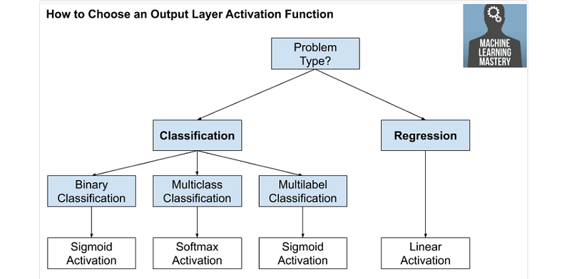{width="6.268055555555556in"
height="3.1118055555555557in"}

The activation function is like a gatekeeper for each neuron in the ANN.
It decides whether a neuron should be "turned on" or "turned off."
Different types of activation functions perform this decision-making
process in different ways \[6\].

**Section 2-The Role of Activation Functions in Neural Networks**

*When you build your neural network, one of the choices you get to make
is what activation function to use in the hidden layers as well as at
the output units of your neural network. So far, we've just been using
the sigmoid activation function, but sometimes other choices can work
much better \[2\].*

*Yet without activation functions, the neurons would just be doing
boring linear math with the inputs. This means that no matter how many
layers of neurons we add to the network, it would still be limited in
what it can learn because the output would always be a simple linear
combination of the inputs.*

*Activation functions come to the rescue by introducing non-linearity
into the network. This indicates that a neuron's output can be more
complex than a simple linear sum of its inputs. By adding non-linearity,
the network can model more complex relationships between the inputs and
outputs, allowing it to discover more interesting and valuable patterns
\[2\].*

*So, in short, activation functions are like the secret sauce that makes
neural networks more powerful by introducing non-linearity and allowing
them to learn complex patterns \[2\].*

*So, in short, activation functions are like the secret sauce that makes
neural networks more powerful by introducing non-linearity and allowing
them to learn complex patterns \[2\].*

*Non-linear functions, such as the sigmoid function, Tanh, ReLU and
ELUs, provide results that are not proportional to the input. As a
result, each type of activation function has its own unique
characteristics that can be useful in different scenarios \[2\]*.

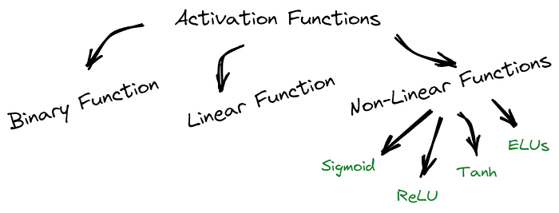{width="6.268055555555556in"
height="2.388888888888889in"}

**Section 2- Sigmoid Function**

So that sigmoid is called an activation function. And here's the
familiar sigmoid function, a = 1/1 + e to -z.

So for example, **the sigmoid function goes between zero and one. An
activation function that almost always works better than the sigmoid
function is the tangent function or the hyperbolic tangent function**.

*Let me break down the Sigmoid Activation Function for you. This
function takes any number as input and gives us an output between 0
and 1. The more positive the input, the closer the output will be to 1.
On the other hand, the more negative the input, the closer the output
will be to 0, as illustrated in the image below \[2\].*

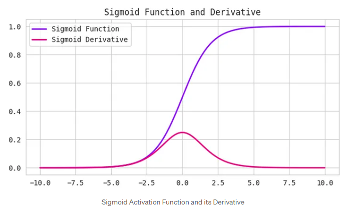{width="6.268055555555556in"
height="3.8222222222222224in"}

**Section 3- Tan H Function**

So this is z, this is a, this is a = tan h(z). And this goes between +1
and -1. The formula for the tan h function is e to the z minus e to-z
over their sum. And it's actually** mathematically a shifted version of
the sigmoid function**. So as a sigmoid function just like that but
shifted so that it now crosses the zero zero point on the scale. So it
goes between minus one and plus one.

*So, the Tanh function, also known as the hyperbolic tangent function,
is another type of activation function used in neural networks. It takes
any real number as input and outputs a value between -1 and 1 \[2\].
Here's the thing, the Tanh function is very similar to the Sigmoid
function, but it's a bit more centred around zero. That means when the
input is close to zero, the output will be close to zero as well. This
can be useful when dealing with data that has both negative and positive
values because it can help the network learn better \[2\].*

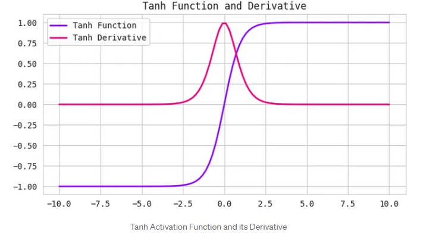{width="6.268055555555556in"
height="3.3979166666666667in"}

And it turns out that for hidden units, if you let the function g(z) be
equal to tan h(z). This almost always works better than the sigmoid
function because with values between plus one and minus one, the mean of
the activations that come out of your hidden layer are closer to having
a zero mean. And so just as sometimes when you train a learning
algorithm, you might center the data and have your data have zero mean
using a tan h instead of a sigmoid function. Kind of has the effect of
centering your data so that the mean of your data is close to zero
rather than maybe 0.5. And this actually makes learning for the next
layer a little bit easier.

But one takeaway is that I pretty much never use the sigmoid activation
function anymore. The tan h function is almost always strictly superior.
The one exception is for the output layer because if y is either zero or
one, then it makes sense for y hat to be a number that you want to
output that's between zero and one rather than between -1 and 1. So the
one exception where I would use the sigmoid activation function is when
you're using binary classification. In which case you might use the
sigmoid activation function for the upper layer. So g(z2) here is equal
to sigmoid of z2. And so what you see in this example is where you might
have a tan h activation function for the hidden layer and sigmoid for
the output layer.

So the activation functions can be different for different layers. And
sometimes to denote that the activation functions are different for
different layers, we might use these square brackets superscripts as
well to indicate that gf square bracket one may be different than gf
square bracket two, right. Again, square bracket one superscript refers
to this layer and superscript square bracket two refers to the output
layer.

Now, one of the downsides of both the sigmoid function and the tan h
function is that if z is either very large or very small, then the
gradient of the derivative of the slope of this function becomes very
small. So if z is very large or z is very small, the slope of the
function either ends up being close to zero and so this can slow down
gradient descent

**Section 4-Rectified Linear Unit / ReLU Function**

**Def**: *Rectified Linear Unit, or ReLU, is a common activation
function that is both simple and powerful. It takes any input value and
returns it if it is positive or 0 if it is negative. In other words,
ReLU sets all negative values to 0 and keeps all positive values as they
are \[2\].*

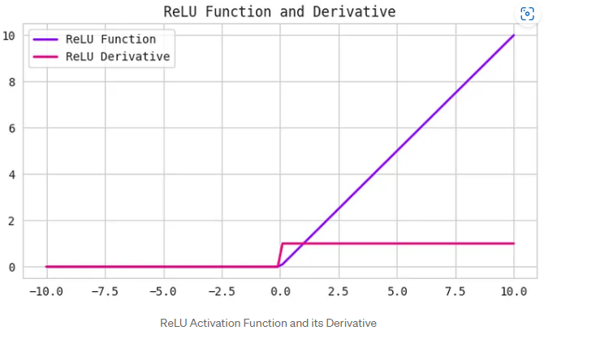{width="6.268055555555556in"
height="3.502083333333333in"}

So one other choice that is very popular in machine learning is what's
called the rectified linear unit. So the value function looks like this
and the formula is a = max(0,z). So the derivative is one so long as z
is positive and derivative or the slope is zero when z is negative. If
you're implementing this, technically the derivative when z is exactly
zero is not well defined. But when you implement this in the computer,
the odds that you get exactly z equals 000000000000 is very small. So
you don't need to worry about it. In practice, you could pretend a
derivative when z is equal to zero, you can pretend is either one or
zero. And you can work just fine. So the fact is not differentiable.

The fact that, so here's some rules of thumb for choosing activation
functions. If your output is zero one value, if you're using binary
classification, then the sigmoid activation function is very natural
choice for the output layer. And then for all other units value or the
rectified linear unit is increasingly the default choice of activation
function. So if you're not sure what to use for your hidden layer, I
would just use the value activation function, is what you see most
people using these days. Although sometimes people also use the tan h
activation function. One disadvantage of the value is that the
derivative is equal to zero when z is negative. In practice this works
just fine.

**Leaky ReLU Function**

*Def:The Leaky ReLU function is an extension of the ReLU function that
attempts to solve the "dying ReLU" problem. Instead of setting all
negative values to 0, Leaky ReLU sets them to a small positive value,
such as 0.1 times the input value. his guarantees that even if a neuron
receives negative information, it may still learn from it\[2\].*

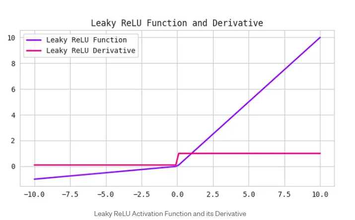{width="6.268055555555556in"
height="3.886111111111111in"}

But there is another version of the value called the Leaky ReLU. We'll
give you the formula on the next slide but instead of it being zero when
z is negative, it just takes a slight slope like so. So this is called
Leaky ReLU. This usually works better than the value activation
function. Although, it's just not used as much in practice. Either one
should be fine. Although, if you had to pick one, I usually just use the
value. And the advantage of both the value and the Leaky ReLU is that
for a lot of the space of z, the derivative of the activation function,
the slope of the activation function is very different from zero. And so
in practice, using the value activation function, your neural network
will often learn much faster than when using the tan h or the sigmoid
activation function. And the main reason is that there's less of this
effect of the slope of the function going to zero, which slows down
learning. And I know that for half of the range of z, the slope for
value is zero. But in practice, enough of your hidden units will have z
greater than zero. So learning can still be quite fast for most training
examples.

**Section 6- Exponential Linear Units (ELUs) Function**

*Another form of activation function that has gained prominence in
recent years is Exponential Linear Units or ELUs. Like ReLU, they aim to
address the vanishing gradient problem. ELUs introduce a non-zero slope
for negative inputs, which aids in the prevention of the "dying ReLU"
problem \[2\].*

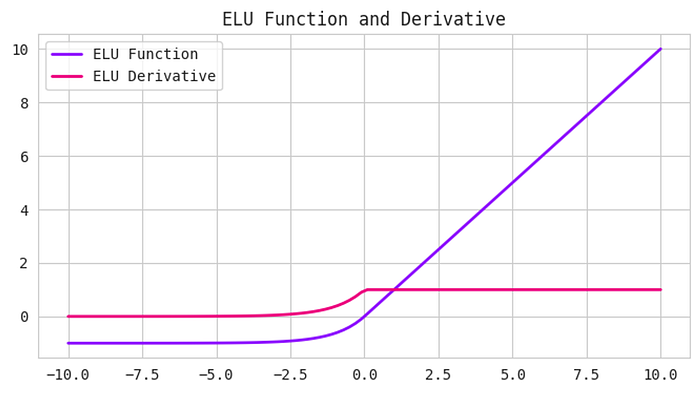{width="6.268055555555556in"
height="3.5215277777777776in"}

The formula for Exponential Linear Units (ELUs) is:

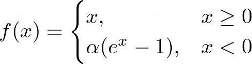{width="5.10625in" height="1.3027777777777778in"}

*Where alpha is a hyperparameter that controls the degree of negative
saturation.*

*ELUs have been shown to improve both training and test accuracy
compared to other activation functions like ReLU and tanh. They are
particularly useful in deep neural networks that require a high level of
accuracy \[2\].*

**Section 7- Softmax Function**

*The softmax function is often used as the activation function in the
output layer of a neural network that needs to classify inputs into
multiple categories. It takes as input a vector of real numbers and
returns a probability distribution that represents the likelihood of
each category \[2\].*

*The formula for softmax is:*

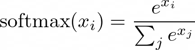{width="4.128472222222222in"
height="1.0756944444444445in"}

Where **x** is the input vector and **i** and **j** are indices that
range from 1 to the number of categories \[2\].

Softmax is useful for multi-class classification problems because it
ensures that the output probabilities sum to 1, making it easy to
interpret the results. It is also differentiable, which allows it to be
used in backpropagation during training\[2\].

**Section 8- Swish**

*The Swish function is a relatively new activation function that has
gained attention in the deep learning community for its improved
performance over other activation functions like ReLU \[2\].*

*The formula for Swish is:*

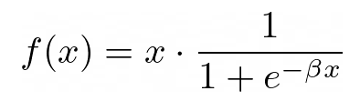{width="4.10625in" height="1.1513888888888888in"}

Where beta is a hyperparameter that controls the degree of saturation.

*Swish is similar to ReLU in that it is a simple function that can be
computed efficiently. It does, however, have a smooth curve that aids in
the prevention of the "dying ReLU" problem. Swish has been shown to
outperform ReLU on a variety of deep learning tasks \[2\].*

**Section 9- Pros and Cons of activation function**

So let's just quickly recap the pros and cons of different activation
functions.

Here's the sigmoid activation function. I would say never use this
except for the output layer if you're doing binomial classification or
maybe almost never use this.

And the reason I almost never use this is because the tan h is pretty
much strictly superior. So the tan h activation function is this.

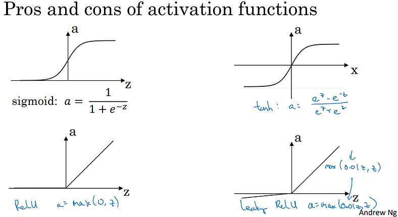{width="6.268055555555556in"
height="3.417361111111111in"}

And then the default, the most commonly used activation function is the
ReLU, which is this. So if you're not sure what else to use, use this
one. And maybe, feel free also to try the Leaky ReLU where might be
0.01(z,z), right? So a is the max of 0.1 times z and z. So that gives
you this bend in the function. And you might say, why is that constant
0.01? Well, you can also make that another parameter of the learning
algorithm. And some people say that works even better, but how they see
people do that. So, but if you feel like trying it in your application,
please feel free to do so. And you can just see how it works and how
well it works, and stick with it if it gives you a good result.

So I hope that gives you a sense of some of the choices of activation
functions you can use in your neural network. One of the things we'll
see in deep learning is that you often have a lot of different choices
in how you build your neural network. Ranging from a number of hidden
units to the choices activation function, to how you initialize the ways
which we'll see later. A lot of choices like that. And it turns out that
it is sometimes difficult to get good guidelines for exactly what will
work best for your problem. So throughout these courses, I'll keep on
giving you a sense of what I see in the industry in terms of what's more
or less popular. But for your application with your applications,
idiosyncrasies is actually very difficult to know in advance exactly
what will work best. So common piece of advice would be, if you're not
sure which one of these activation functions work best, try them all.
And evaluate on like a holdout validation set or like a development set,
which we'll talk about later. And see which one works better and then go
of that. And I think that by testing these different choices for your
application, you'd be better at future proofing your neural network
architecture against the idiosyncracies problems. As well as evolutions
of the algorithms rather than, if I were to tell you always use a value
activation and don't use anything else. That just may or may not apply
for whatever problem you end up working on. Either in the near future or
in the distant future. All right, so, that was choice of activation
functions and you see the most popular activation functions. There's one
other question that sometimes you can ask which is, why do you even need
to use an activation function at all? Why not just do away with that?
So, let's talk about that in the next tutorial where you see why neural
networks do need some sort of non linear activation function.

Here is a quick recap of the pros and cons of different activation
functions:

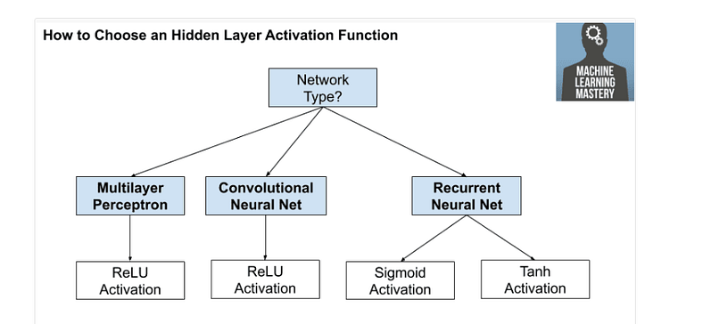{width="6.268055555555556in"
height="2.9027777777777777in"}

-   Sigmoid Activation Function: Almost never used, except for the
    output layer in binary classification.

-   Tanh Activation Function: Strictly superior to the sigmoid function,
    especially for hidden units.

-   ReLU Activation Function: The default choice for most hidden layers,
    as it often leads to faster learning.

-   Leaky ReLU Activation Function: Similar to ReLU, but with a slight
    slope for negative values of z. Can be an alternative to ReLU.

-   *Sigmoid function it suffers from the vanishing gradient problem.
    This indicates that when the input becomes increasingly large or
    tiny, the gradient of the function becomes very small, slowing down
    the learning process in deep neural networks\[2\].*

-   However, like the Sigmoid function, the Tanh function can also
    suffer from the vanishing gradient problem as the input becomes very
    large or very small. Yet, the Tanh function is still commonly used
    in neural networks, especially in the hidden layers of the network
    \[2\].

-   One of the benefits of using ReLU is that it is computationally
    efficient and simple to implement. It is also known for helping to
    mitigate the vanishing gradient problem that can occur in deep
    neural networks \[2\].

-   However, ReLU can suffer from a problem known as the "dying ReLU"
    problem. This happens when a neuron's input is negative, leading the
    neuron to output 0. If this happens too frequently, the neuron
    "dies" and stops learning \[2\].

-   The fact that, so here's some rules of thumb for choosing activation
    functions. If your output is zero one value, if you're using binary
    classification, then the sigmoid activation function is very natural
    choice for the output layer. And then for all other units value or
    the rectified linear unit is increasingly the default choice of
    activation function. So if you're not sure what to use for your
    hidden layer, I would just use the value activation function, is
    what you see most people using these days. Although sometimes people
    also use the tan h activation function. One disadvantage of the
    value is that the derivative is equal to zero when z is negative. In
    practice this works just fine.

-   PReLU has been shown to work well in some types of problems,
    particularly in image recognition tasks\[2\].

-   *ReLU activation function should only be used in the hidden
    layers\[2\].*

-   *Sigmoid/Logistic and Tanh functions should not be used in hidden
    layers as they can cause problems during training.\[2\]*

-   *Regression --- Linear Activation Function*

-   *Binary Classification --- Sigmoid/Logistic Activation Function*

-   *Multiclass Classification --- Softmax*

-   *Multilabel Classification --- Sigmoi*

\*\*Quick Recap of Activation Functions\*\*

\#### \*\*1. Sigmoid Activation Function\*\*

\- \*\*Pros:\*\*

\- \*\*Binary Classification:\*\* Good for the output layer in binary
classification problems.

\- \*\*Cons:\*\*

\- \*\*Vanishing Gradient:\*\* Can cause learning problems in deep
networks because gradients become very small with large or small inputs.

\- \*\*Rarely Used:\*\* Almost never used in hidden layers due to the
problems above.

\*\*When to Use:\*\* For the output layer of binary classification.

\-\--

\#### \*\*2. Tanh Activation Function\*\*

\- \*\*Pros:\*\*

\- \*\*Better than Sigmoid:\*\* Generally preferred over sigmoid for
hidden layers because it's zero-centered and can help with convergence.

\- \*\*Cons:\*\*

\- \*\*Vanishing Gradient:\*\* Can still suffer from vanishing gradients
for very large or small inputs, though less than sigmoid.

\*\*When to Use:\*\* For hidden layers in deep networks.

\-\--

\#### \*\*3. ReLU (Rectified Linear Unit) Activation Function\*\*

\- \*\*Pros:\*\*

\- \*\*Default Choice:\*\* Often used in hidden layers because it speeds
up learning and is computationally efficient.

\- \*\*Avoids Vanishing Gradients:\*\* Helps avoid the vanishing
gradient problem.

\- \*\*Cons:\*\*

\- \*\*Dying ReLU Problem:\*\* Neurons can \"die\" and stop learning if
they output zero for all inputs.

\*\*When to Use:\*\* For most hidden layers in neural networks.

\-\--

\#### \*\*4. Leaky ReLU Activation Function\*\*

\- \*\*Pros:\*\*

\- \*\*Fixes Dying ReLU:\*\* Allows a small gradient for negative inputs
to avoid the dying ReLU problem.

\- \*\*Cons:\*\*

\- \*\*Not as Common:\*\* Not always used, but can be tried as an
alternative to ReLU.

\- \*\*Needs Tuning:\*\* The slope for negative values (\\(\\alpha\\))
might need tuning.

\*\*When to Use:\*\* When ReLU causes too many dead neurons.

\-\--

\#### \*\*5. Parametric ReLU (PReLU) Activation Function\*\*

\- \*\*Pros:\*\*

\- \*\*Adaptive:\*\* Learns the slope for negative values during
training, which can lead to better performance.

\- \*\*Cons:\*\*

\- \*\*More Complex:\*\* Adds more parameters to learn, which can
increase complexity.

\*\*When to Use:\*\* For advanced applications, particularly in image
recognition tasks.

\-\--

\#### \*\*6. ELU (Exponential Linear Unit) Activation Function\*\*

\- \*\*Pros:\*\*

\- \*\*Improves Learning:\*\* Addresses both vanishing gradients and
dead neurons.

\- \*\*Cons:\*\*

\- \*\*Computationally Expensive:\*\* More complex and
resource-intensive compared to ReLU.

\*\*When to Use:\*\* When you need a smooth, non-linear activation that
avoids dead neurons.

\-\--

\#### \*\*7. Softmax Activation Function\*\*

\- \*\*Pros:\*\*

\- \*\*Multi-Class Classification:\*\* Converts output into
probabilities for multi-class classification.

\- \*\*Cons:\*\*

\- \*\*Not for Hidden Layers:\*\* Generally used only for the output
layer.

\*\*When to Use:\*\* For the output layer in multi-class classification
problems.

\-\--

\#### \*\*8. Swish Activation Function\*\*

\- \*\*Pros:\*\*

\- \*\*Smooth and Effective:\*\* Can lead to better performance in some
applications.

\- \*\*Cons:\*\*

\- \*\*Computationally Expensive:\*\* Requires calculation of the
sigmoid function.

\*\*When to Use:\*\* As an alternative to ReLU for potentially better
performance.

\### \*\*Rules of Thumb\*\*

\- \*\*Binary Classification Output:\*\* Use \*\*Sigmoid\*\*.

\- \*\*Hidden Layers:\*\* Use \*\*ReLU\*\* (or try \*\*Leaky ReLU\*\* or
\*\*ELU\*\*).

\- \*\*Multi-Class Classification Output:\*\* Use \*\*Softmax\*\*.

\- \*\*Experiment:\*\* If unsure, try different activation functions and
choose based on validation performance.

\### \*\*Why Use Activation Functions?\*\*

Activation functions introduce non-linearity into the model, which is
crucial for learning complex patterns and solving real-world problems.
