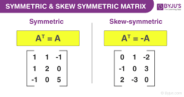

**The Mathematics of Data Science and Machine Learning**

Machine Learning theory is a field that intersects statistical,
probabilistic, computer science and algorithmic aspects arising from
learning iteratively from data and finding hidden insights which can be
used to build intelligent applications. Despite the immense
possibilities of Machine and Deep Learning, a thorough mathematical
understanding of many of these techniques is necessary for a good grasp
of the inner workings of the algorithms and getting good results.

**Why Worry About the Maths?**

There are many reasons why the mathematics of Machine Learning is
important and I will highlight some of them below:

1.  Selecting the right algorithm which includes giving considerations
    to accuracy, training time, model complexity, number of parameters
    and number of features.

2.  Choosing parameter settings and validation strategies.

3.  Identifying underfitting and overfitting by understanding the
    Bias-Variance trade-off.

> *The bias-variance tradeoff is a fundamental concept in machine
> learning that relates to the performance of predictive models.*
>
> *Bias refers to the error that is introduced by approximating a
> real-world problem with a simplified model. Models with high bias tend
> to oversimplify the problem, leading to underfitting and poor
> performance on both training and test data.*
>
> *Variance, on the other hand, refers to the error that is introduced
> by the model\'s sensitivity to small fluctuations in the training
> data. Models with high variance tend to overfit the training data,
> leading to excellent performance on the training data but poor
> performance on the test data.*
>
> *The bias-variance trade-off occurs because reducing bias often
> increases variance, and reducing variance often increases bias.
> Therefore, the goal is to find the right balance between bias and
> variance that results in the best possible predictive performance on
> the test data.*
>
> *Some techniques for balancing the bias-variance trade-off include
> cross-validation, regularization, and ensemble methods such as bagging
> and boosting.*

4.  Estimating the right confidence interval and uncertainty.

> *Confidence in statistics refers to the degree of certainty that a
> population parameter falls within a certain range of values based on a
> sample of data. The level of confidence is typically expressed as a
> percentage, and it represents the probability that the true population
> parameter falls within the confidence interval.*
>
> *For example, a 95% confidence interval means that there is a 95%
> probability that the true population parameter lies within the
> calculated range of values. This does not mean that there is a 95%
> probability that the calculated interval contains the true population
> parameter, but rather that if the experiment were repeated many times,
> 95% of the intervals would contain the true population parameter.*
>
> *The level of confidence chosen for a confidence interval depends on
> the level of risk one is willing to accept. A higher level of
> confidence, such as 99%, indicates a lower level of risk, but it may
> also result in a wider confidence interval and lower precision in the
> estimate of the population parameter.*
>
> *Uncertainty refers to the level of confidence we have in our estimate
> of a population parameter.*
>
> *Suppose a researcher wants to estimate the mean weight of all adult
> men in a certain city. The researcher collects a random sample of 100
> adult men from the city and calculates their average weight to be 175
> pounds with a standard deviation of 10 pounds.*
>
> *The researcher wants to estimate the population mean weight with 95%
> confidence. Using a t-distribution with 99 degrees of freedom (based
> on the sample size minus one), the critical value for a 95% confidence
> interval is 1.984. The standard error of the sample mean can be
> calculated as the sample standard deviation divided by the square root
> of the sample size, which gives 1 pound.*
>
> *The confidence interval can then be calculated as:*
>
> *175 ± 1.984 \* 1 = \[172.056, 177.944\]*
>
> *This means that the researcher is 95% confident that the true mean
> weight of all adult men in the city lies between 172.056 pounds and
> 177.944 pounds.*

**What Level of Maths Do You Need?**

The main question when trying to understand an interdisciplinary field
such as Machine Learning is the amount of maths necessary and the level
of maths needed to understand these techniques. The answer to this
question is multidimensional and depends on the level and interest of
the individual. Research in mathematical formulations and theoretical
advancement of Machine Learning is ongoing and some researchers are
working on more advance techniques. I will state what I believe to be
the minimum level of mathematics needed to be a Machine Learning
Scientist/Engineer and the importance of each mathematical concept.

{width="4.13780949256343in"
height="3.164557086614173in"}

Linear Algebra: Vectors, matrices, eigenvectors, and eigenvalues are
important concepts in machine learning. It is also used in solving
systems of linear equations and for dimensionality reduction techniques
such as PCA.

Calculus: Differential calculus is useful in optimization problems,
which is a central theme in machine learning. Integral calculus is used
in probability theory, which is another important area of machine
learning.

Probability and Statistics: Probability theory is the foundation of
statistical inference, which is used to draw conclusions from data.
Statistical concepts such as hypothesis testing, confidence intervals,
and regression analysis are important tools in machine learning.

Multivariate Calculus: Multivariate calculus extends calculus to
functions of more than one variable. It is used in optimization problems
in which the goal is to find the optimal values of multiple variables
simultaneously.

Optimization: Optimization is the process of finding the minimum or
maximum value of a function. It is used in machine learning to find the
best values of model parameters that minimize a cost function.

Information Theory: Information theory is used to quantify the amount of
information in data. It is used in machine learning to measure the
entropy of a probability distribution or the mutual information between
two variables.

Graph Theory: Graph theory is used in machine learning to represent data
as graphs or networks. It is also used in developing algorithms for
clustering, classification, and anomaly detection.

Numerical Methods: Numerical methods are used to solve mathematical
problems that cannot be solved analytically. They are used in machine
learning to implement optimization algorithms and solve differential
equations.

**Introduction**

Linear algebra is a fascinating branch of mathematics that deals with
the study of linear systems of equations. It explores how vectors,
lines, and planes can be used to represent real-world phenomena and
optimize machine learning algorithms. For instance, large datasets can
be represented as matrices, where each feature and sample are expressed
as a vector in the matrix. Furthermore, linear transformations can be
applied to images, and dimensionality can be reduced by determining the
eigenvectors and eigenvalues, a technique commonly used in facial
recognition software. With these powerful tools, linear algebra plays a
crucial role in ML and is a subject worth exploring in greater detail.

The building blocks of linear algebra are vectors, mathematical objects
that describe both the direction and magnitude of an object in an
n-dimensional space. This space is known as a vector space, a collection
of vectors that can be added together or multiplied by a scalar (a real
number). There are also vector spaces that use complex numbers (i.e.,
non-real numbers) for transformations. For example, quantum computing
relies on complex vector spaces to perform quantum algorithms. Having a
strong foundation in linear algebra opens up a world of possibilities,
whether it's specializing in ML or branching out into new disciplines
such as quantum computing. The following gif offers a simple visual
representation of a 2-dimensional vector space and two vectors within
it:

{width="6.268055555555556in"
height="4.24050634295713in"}

We can apply most of the commonly known mathematical operations on
vectors and matrices. The following animations show how vector addition
looks like:

{width="6.268055555555556in"
height="4.632911198600175in"}

Note that each vector has an arrow pointing to a certain direction and a
specific size.

{width="6.268055555555556in"
height="4.316455599300087in"}

Moreover, vector operations have the following properties:

*Let a, b, c be vectors and m, n be scalars.*

{width="6.268055555555556in"
height="4.379747375328084in"}

Many students are unsure of what constitutes a linear function. A common
misconception is that it must result in a straight line, but that's not
the case. A linear function is defined as one whose coefficients are
either constants or products of a constant. The linearity assumption
limits variables, not coefficients, from having an exponent higher than
1.

For example, f(x) = a + b + c \* 4 and g(x) = β \* x1 + α² \* 2x, where
a, b, c, β, and α are all real numbers, are both linear functions, while
f(x) = x² is not.

The inner product

The inner (aka Dot) product is an operation used to associate pairs of
vectors. It allows for a rigorous introduction of intuitive geometrical
notions such as the length of a vector or the angle between two vectors.
Furthermore, it provides the means to define orthogonality between
vectors in a vector space. The dot product is denoted as \<a, b\>
= a\^T ⋅ b = ∑ a_i ⋅ b_i, where a and b are vectors and a\^T represents
the transpose of a. In other words, it is the sum of the product of each
element in the vectors. Thus, it returns a scalar that contains useful
information about the vectors. The dot product can be used to find
vector length \|a\| = sqrt(\<a, a\>) and the cosine of the angle between
vectors cos(θ) = \<a,b\> / \|a\|⋅\|b\|, useful for computing similarity
measures in ML and NLP.

{width="6.268055555555556in"
height="4.24050634295713in"}

Norms

Norms are an essential concept in linear algebra as they provide a way
to measure the size or magnitude of a vector. Different norms exist, but
the most general form of such a function is the LP norm (also denoted
p-norm):

LP norm: (∑\|x_i\|\^p)\^(1/p)

where p is a positive real number, a_i is the i-th element of the
vector a, and the summation is taken over all elements of the vector.

The most commonly used norms are the L1 and L2 norms. The L2 norm, also
known as the Euclidean distance, is defined as:

L2 norm: (∑\|x_i\|²)\^(1/2), case where p=2

The L1 norm, also known as the Manhattan distance, is defined as:

L1 norm: ∑\|x_i\|, case where p=1

The choice of norm depends on the specific problem and context and can
have a significant impact on the performance of algorithms such as
linear regression or K-means clustering. Norms can also be used to
measure the distance between two vectors and provide a way to measure
the similarity between two data points in a high-dimensional space.

**Outer (tensor) product**

This is our tool to create matrices from vectors. The outer product of
two vectors of size *n *and* *m, yields a matrix of size *n × m.*

*In this updated version, I felt I needed to elaborate further on the
outer product. It plays an important role across many disciplines.*

It is defined as follows: The Outer* *Product u ⊗ v is equivalent to
a [[matrix
multiplication]{.underline}](https://handwiki.org/wiki/Matrix_multiplication) u ⋅ v\^T, where u
and v are vectors (i.e., 1-dimensional matrices)*.* If you are dealing
with complex numbers, then you must apply a conjugate transpose instead
of the simple(?) transpose.

{width="6.268055555555556in"
height="4.145569772528434in"}

Note we have vectors a and b of size *n*, and their outer (or tensor)
product yields and *n × n *matrix. This operation is closely related to
the Kronecker product, which has applications in areas such as quantum
mechanics, signal processing, and image compression. The outer product
is a powerful tool for manipulating matrices and is an important concept
to understand in linear algebra. Get ready to dive into matrices!

*Note: For us to be able to compute the product between two vectors (or
matrices), the vector on the left must have the same number of rows as
the number of columns of the vector on the right. In the example
provided a has *n *rows and b has *n *columns after transposing it (more
on this in a little bit).*

### Data Representation 

** **The fuel of ML models, that is **data**, needs to be converted into
arrays before you can feed it into your models. The computations
performed on these arrays include operations like matrix multiplication
(dot product). This further returns the output that is also represented
as a transformed matrix/tensor of numbers.

## From Data to Vectors

{width="4.307271434820647in"
height="2.4504582239720034in"}

Linear algebra basically deals with vectors and matrices (different
shapes of arrays) and operations on these arrays. In NumPy, vectors are
basically a 1-dimensional array of numbers but geometrically, they have
both magnitude and direction.

{width="4.164038713910761in"
height="2.3431364829396326in"}

Our data can be represented using a vector. In the figure above, one row
in this data is represented by a feature vector which has 3 elements or
components representing 3 different dimensions. N-entries in a vector
makes it n-dimensional vector space and in this case, we can see
3-dimensions.

**Matrix characteristics**

Matrices are a collection of numbers arranged in rows and columns, and
they are widely used in linear algebra to represent the coefficients of
linear equations. Matrices can be of higher dimensions beyond two, and
such objects are often referred to as Tensors, with a rank 0 tensor
being a scalar, rank 1 being a vector, and rank n being a tensor with n
dimensions. The rank of a matrix refers to the maximum number of
linearly independent rows/columns in that matrix and is an important
concept in linear algebra. Matrices can be used for transformations,
data storage, and various other applications in machine learning.

{width="6.267951662292213in"
height="4.943038057742782in"}

-Okay, more terminology, what do you mean by *linearly independent*?
A linearly independent vector x is one that cannot be represented as a
linear combination of any other vector in the matrix. Meaning there is
no scalar by which we could multiply any of the vectors of the matrix
such that the result is the vector x. 

Check out the following example, which I hope will help clarify the
definition of Rank and Linear independence:

Here, matrix A is of Rank (2) because it only has two linearly
independent vectors. Note that the vectors in black are all linear
combinations of each other \[1 2\] can be multiplied by 2 to get \[2 4\]
and so on, but there is no number by which we could multiply any of the
vectors in black that will yield the vector in red \[2 3\].

**Matrix Transpose**

To transpose a matrix of size *n *x *n*, interchange row *i* with
column *i, for all i:1,...,n*. Transposing a matrix has many
applications in linear algebra, including changing the orientation of
vectors and solving systems of linear equations. The transpose of a
matrix is also useful in machine learning as it can simplify certain
matrix operations and make it easier to perform mathematical
calculations; here is an example:

{width="6.267656386701662in"
height="4.721519028871391in"}

The transpose of a matrix can also be used to switch the row and column
space of a matrix, which can be useful in various mathematical
operations. Transposing a matrix can also help simplify certain
computations, such as finding eigenvalues, the trace of a square matrix,
and derivatives of the determinant. The trace, denoted tr(A), is defined
to be the sum of elements on the main diagonal. Furthermore, it is
related to the derivative of the determinant, useful for proving
statements about matrix algebra.

**Determinant**

The determinant is a crucial mathematical tool in matrix algebra that
has a wide range of applications, including in the field of machine
learning. It is a scalar value that can be calculated for a square
matrix (a matrix with the same number of rows and columns). The
determinant has a number of interesting properties, including the fact
that it can be used to determine the invertibility of a matrix and to
calculate the area or volume of certain geometric objects.

One important application of the determinant in machine learning is in
the calculation of the covariance matrix. The covariance matrix is a
crucial component in many machine learning algorithms, such as principal
component analysis (PCA) and linear discriminant analysis (LDA), that
are used for dimensionality reduction and classification, respectively.
The determinant of the covariance matrix provides information about the
spread of the data and can be used to evaluate the importance of each
principal component in PCA or each discriminant in LDA.

The determinant of a square matrix is a scalar value that has several
important geometric and algebraic interpretations. Here are some key
points regarding the determinant and its meaning:

1\. \*\*Geometric Interpretation:\*\*

\- For a 2x2 matrix, the determinant represents the signed area of the
parallelogram spanned by the column vectors.

\- For a 3x3 matrix, the determinant represents the signed volume of the
parallelepiped spanned by the column vectors.

2\. \*\*Algebraic Interpretation:\*\*

\- The determinant is used to determine whether a square matrix is
invertible (non-singular). If the determinant is non-zero, the matrix is
invertible, and its inverse exists.

\- If the determinant is zero, the matrix is singular, and its inverse
does not exist.

3\. \*\*Effect on Linear Transformations:\*\*

\- In the context of linear transformations, the determinant of a matrix
A represents how much the transformation scales volumes. If the
determinant is 1, the transformation preserves volumes; if it\'s -1, the
transformation flips the orientation; if it\'s greater than 1, the
transformation enlarges volumes; if it\'s between 0 and 1, the
transformation shrinks volumes.

4\. \*\*Cramer\'s Rule:\*\*

\- In a system of linear equations, Cramer\'s Rule expresses the
solution in terms of determinants. This rule is applicable when the
system matrix is non-singular (its determinant is non-zero).

5\. \*\*Eigenvalues:\*\*

\- The determinant of a matrix is related to its eigenvalues. The
product of the eigenvalues is equal to the determinant. This connection
is expressed in terms of the characteristic equation.

The determinant is a crucial concept in linear algebra with geometric,
algebraic, and practical implications. It provides information about the
nature of the linear transformation represented by the matrix and its
suitability for various operations, including inversion.

It is computed as follows:

{width="6.268055555555556in"
height="4.512657480314961in"}

The determinant is only defined for square matrices and, as you can see
in the picture, it is calculated by cross multiplying element *a* (2)
times *b* (0) minus *c(-1*) times 1*(1)*. It is very simple to compute
for a 2 × 2 matrix but it grows in complexity as the dimensions of the
matrix increase.

**Eigen-stuff and the Characteristic Equation**

Eigenvectors and eigenvalues are incredibly important concepts in linear
algebra and are used extensively in many areas of mathematics and
science, including machine learning. Eigenvectors are used to represent
the directions along which a linear transformation acts, while
eigenvalues give us information about how much the linear transformation
stretches or compresses those directions. You can think of Eigenvectors
as the pillars of a matrix; they contain fundamental information about
that specific matrix. No surprisingly, they are commonly used in
dimensionality reduction algorithms such as Principal Component Analysis
(PCA) because, in a way, eigenvectors contain a summary of the
information encoded in the matrix.

{width="4.645544619422572in"
height="2.24509842519685in"}

{width="5.544444444444444in"
height="7.220833333333333in"}

Cool, but how do we find the eigenvectors of a matrix?

Well, it is done in three steps:

Find the eigenvalue,

Plug it back in, and

Solve the system of equations.

The eigenvalue is a scalar value, denoted by λ, used to stretch or
compress eigenvectors that satisfy the equation A ⋅ v = λ
⋅ v, where v is the eigenvector, we are trying to find. To find these
scalar values we must solve a particular equation called
the characteristic equation, denoted as det(A --- λ ⋅ I) = 0, where A is
our matrix, λ the eigenvalue and I is the identity matrix. Here is how
we solve the characteristic equation:

{width="6.267361111111111in"
height="3.791139545056868in"}

{width="6.267384076990377in"
height="2.4936712598425195in"}

Note how that the yellow and green vectors only change size as they are
transformed, while the red vector changes both size and direction. The
quantity by which the yellow and green vectors stretch or compress is
determined by the *eigenvalue *and the direction is given by
the *eigenvector *itself.

This concept of eigenvectors and eigenvalues is useful in many areas of
mathematics, including finding the diagonalization of matrices, solving
differential equations, and much more. Additionally, they are a key
ingredient in the development of the Principal Component Analysis (PCA)
algorithm, which is widely used in machine learning for data compression
and visualization.

*Vector V can be defined as an element of n dimensional coordinate
system i.e V∈R\^n.*

So for 2D plane \[x,y\] is general form of vector, for 3D it's \[x,y,z\]
as so on for dimensions.

Transpose of vector(V\^T) = vector is represented in column form and
it's transpose is the row representation of same.

{width="2.386111111111111in"
height="1.2402777777777778in"}

**vector transpose**

*A matrix M can be defined as an element M∈R\^(mxn) i.e m collection of
n dimensional vectors taken as row of matrix having dimension mxn.*

{width="3.113888888888889in"
height="1.4555555555555555in"}

matrix of dim mxn

**Transpose of matrix: -**

{width="3.772222222222222in"
height="1.4493055555555556in"}

**matrix transpose**

We can consider vector as a single dimensional array and matrix as an 2
dimensional array.

In machine learning we may need multidimensional array as form of data
to perform computation and operation which we refer as tensor.

*Tensor is the generalization of vectors and matrices mostly understood
as multidimensional array.*

Vector is 1st order or single dimensional tensor while matrix is 2D
tensor.

{width="3.9368055555555554in"
height="1.386111111111111in"}

**elements in linear algebra**

We will now study properties and operations of 1D(vector) and 2D(matrix)
tensor and that can be generalized to all higher dimensions.

{width="6.222295494313211in"
height="4.97468394575678in"}

**multi-dimensional tensor**

Operations on vectors

**operations with scalar: -** any operation with scalar is performed
with every element of vector.

**Addition and Subtraction: - **vectors of same dimension are added and
subtracted element-wise.

{width="2.9680555555555554in"
height="1.8479166666666667in"}

**Dot product/Inner product :-** dot product and inner product are two
different things in mathematics but will be same in our context.It is
the summation of element-wise product of two vectors of same dimension.

{width="4.367361111111111in"
height="1.2534722222222223in"}

**dot product of vectors**

**Outer product:- **element wise scaling of one vector by another that
results in matrix is called outer product

{width="5.189583333333333in"
height="1.0506944444444444in"}

**outer product of vectors**

Operations on matrices

**matrix matrix multiplication:- **It can be regarded as inner products
of every row on 1st matrix with columns of 2nd matrix.

{width="5.209027777777778in"
height="5.715277777777778in"}

**inner product explanation of matrix multiplication**

It can also be defined as sum of all outer products of row of matrix 1
with column of matrix 2.

{width="4.569444444444445in"
height="1.1965277777777779in"}

**outer product intuition of multiplication**

Both intuition of matrix multiplication gives same result respecting the
norms of mathematics.

**Row Reduction/Gaussian Elimination: - **Some certain operations can be
produced with rows of the matrices that may change the matrix but
doesn't change the interpretation of data or equation represented. These
techniques are generally used to solve system of linear equations and
inverse of matrix.

{width="6.268055555555556in"
height="4.700694444444444in"}

Types and representation of matrix

**Diagonal Matrix = **A matrix with all elements except diagonal being 0
is called diagonal matrix.

{width="3.0319444444444446in"
height="1.8034722222222221in"}

**diagonal matrix**

**Lower Triangular and upper triangular matrix =** A matrix with all
elements below diagonal being 0 is called upper triangular and if all
elements above diagonal is 0 is called lower triangular matrix.

{width="3.4493055555555556in"
height="1.5819444444444444in"}

**Identity matrix = **Diagonal matrix with all element one having
property of A.I = A is called identity matrix.

**Identity matrix**

**Symmetric matrix = **Matrix whose transpose is same to original
matrix.

**Skew-symmetric matrix =** matrix whose transpose is equal to negative
of original matrix.

{width="4.350631014873141in"
height="2.2911384514435698in"}

**Row Echelon form =** A matrix which satisfies following properties is
called in row echelon form.

The first non-zero number from the left (the "[leading
coefficient](https://www.calculushowto.com/leading-coefficient-definition-test/#leading)")
is always to the right of the first non-zero number in the row above.

Rows consisting of all zeros are at the bottom of the matrix.

A matrix is in row echelon form if. All rows having only zero entries
are at the bottom. The leading entry (that is, the left-most nonzero
entry) of every nonzero row, called the pivot, is on the right of the
leading entry of every row above.

**Reduced Row Echelon form = **A matrix which satisfies following
properties is called in reduced row echelon form.

The first non-zero number in the first row (**the leading entry**) is
the number 1.

The second row also starts with the number 1, which is further to the
right than the leading entry in the first row. For every subsequent row,
the number 1 must be further to the right.

The leading entry in each row must be the only non-zero number in its
column.

Any zero rows are placed at the bottom of the matrix.

{width="4.790972222222222in"
height="1.9368055555555554in"}

The matrix can be converted to row echelon or reduced row echelon with
the help of **row reduction method** discussed above.

{width="6.268055555555556in"
height="8.004166666666666in"}

**System of linear equations**

we all know about linear equations

**a0 + a1x1 + ...** **+ anxn = c**

This is the system of m linear equation of n variables shown below

{width="3.7534722222222223in"
height="1.4555555555555555in"}

**m linear equations of n variables**

If all the bi's are 0, it is called homogeneous system of linear
equations

**homogeneous system of linear equation**

Solving the system of linear equation

The system of linear equation can be solved by converting the augmented
matrix formed into row echelon or row reduced echelon form and
substitution.

**Types of Solutions**

There are three types of solutions which are possible when solving a
system of linear equations

1.  Independent

2.  Consistent

3.  Unique Solution

{width="6.268055555555556in"
height="3.4319444444444445in"}

A row-reduced matrix has the same number of non-zero rows as variables

The left-hand side is usually the identity matrix, but not necessarily

There must be at least as many equations as variables to get an
independent solution.

{width="2.2597222222222224in"
height="1.3034722222222221in"}

**When you convert the augmented matrix back into equation form, you get
x=3, y=1, and z=2.**

Dependent

Consistent

infinitely many solutions

Write answer in parametric form

A row-reduced matrix has more variables than non-zero rows

There doesn't have to be a row of zeros, but there usually is.

This could also happen when there are less equations than variables.

{width="2.2402777777777776in"
height="1.2277777777777779in"}

The first equation will be x + 3z = 4. Solving for x gives x = 4--3z.

The second equation will be y --- 2z = 3. Solving for y gives y = 3 +
2z.

The z column is not cleared out (all zeros except for one number) so the
other variables will be defined in terms of z. Therefore, z will be the
parameter t and the solution is ... x = 4--3t, y = 3 + 2t, z = t. since
t can be any parameter, so infinite solutions or simply there are less
equations than variables so infinite values possible for any one
variable.

Inconsistent

No Solution

A row-reduced matrix has a row of zeros on the left side, but the
right-hand side isn't zero.

{width="2.2215277777777778in"
height="1.2597222222222222in"}

**There is no solution here. You can write that as the null set Ø, the
empty set {}, or no solution.**

It indicates that one the equation is in participant to give solution,
so, inconsistent.

**Inverse of matrix**

The inverse of a matrix A is a matrix that, when multiplied by A results
in the identity. The notation for this inverse matrix is A\^--1.

The matrix which have their inverse are called invertible matrices and
others are called singular,i.e matrix where AA\^-1 = I exist are
invertible matrices.

The inverse of the matrix can be found using following steps:-

write the augmented matrix consisting of original matrix and Identity
matrix with original on left and identity on left.

perform gaussian elimination such that original matrix on left is
converted to identity.

During the operation, converted matrix obtained on right side from
identity matrix is the reverse of original matrix.

{width="5.177083333333333in"
height="2.772222222222222in"}

finding inverse of invertible matrix

If A is a non-singular square matrix, there is an existence of n x n
matrix A^-1^, which is called the** inverse matrix** of A such that it
satisfies the property:

AA^-1^ = A^-1^A = I, where I is the Identity matrix

The identity matrix for the 2 x 2 matrix is given by

It is noted that in order to find the inverse matrix, the square matrix
should be non-singular whose determinant value does not equals to zero.

Let us take the square matrix A

Where a, b, c, and d represents the number.

The [determinant of the
matrix](https://byjus.com/maths/determinant-of-a-matrix/) A is written
as ad-bc, where the value of determinant should not equal to zero for
the existence of inverse. The inverse matrix can be found for 2× 2, 3×
3, ...n × n matrices. Finding the inverse of a 3×3 matrix is a
bit more difficult than finding the inverses of a 2 ×2 matrix.\

## Inverse Matrix Method

The inverse of a matrix  can be found using the three different methods.
However, any of these three methods will produce the same result.

### Method 1:

{width="4.091666666666667in"
height="2.091666666666667in"}

Similarly, we can find the inverse of a 3×3 matrix by finding the
determinant value of the given matrix.

### Method 2:

One of the most important methods of finding the matrix inverse involves
finding the minors and cofactors of elements of the given matrix.
Observe the below steps to understand this method clearly.

-   The inverse matrix is also found using the following equation:

**A^-1^= adj(A)/det(A),**

          where *adj(A)* refers to the adjoint of a matrix
A, *det(A)* refers to the determinant of a matrix A.

-   The adjoint of a matrix A or adj(A) can be found using the following
    method.

          In order to find the adjoint of a matrix A first, find the
cofactor matrix of a given matrix and then   

          take the transpose of a cofactor matrix.

-   The cofactor of a matrix can be obtained as

C~ij~ = (-1)^i+j^ det (Mij)

Here, Mij refers to the (i,j)^th^ minor matrix after removing the
ith row and the jth column. You can also say that the transpose of a
cofactor matrix is also called the adjoint of a matrix A.\

### **Method 3:**

Finding an **Inverse Matrix by Elementary Transformation**

Let us consider three matrices X, A and B such that X = AB. To determine
the inverse of a matrix using elementary transformation, we convert the
given matrix into an identity matrix. 

If the inverse of matrix A, A^-1^ exists then to determine A^-1^ using
elementary row operations

1.  Write A = IA, where I is the identity matrix of the same order as A.

2.  Apply a sequence of row operations till we get an identity matrix on
    the LHS and use the same elementary operations on the RHS to get I =
    BA. The matrix B on the RHS is the inverse of matrix A.

3.  To find the inverse of A using column operations, write A = IA and
    apply column operations sequentially till I = AB is obtained, where
    B is the inverse matrix of A.

### Inverse of a Matrix Formula

{width="2.8916666666666666in"
height="2.0083333333333333in"}\

### Inverse Matrix 2 x 2 Example

To understand this concept better let us take a look at the following
example.

Example: Find the inverse of matrix A given below:

{width="2.8833333333333333in"
height="6.45in"}\

### Inverse Matrix 3 x 3 Example

**Problem**:

{width="2.966666666666667in"
height="0.8333333333333334in"}

**Solution**:

Determinant of the given matrix is

Let us find the minors of the given matrix as given below:

{width="2.225in"
height="5.175in"}

Now, find the adjoint of a matrix by taking the transpose of cofactors
of the given matrix.

{width="3.1166666666666667in"
height="0.8333333333333334in"}

Now,

A^-1^ = (1/\|A\|) Adj A

Hence, the inverse of the given matrix is:

\

### Properties

A few important [properties of the inverse
matrix](https://byjus.com/maths/properties-of-matrices-inverse/) are
listed below.

-   If A is nonsingular, then (A^-1^)^-1^  =  A

-   If A and B are nonsingular matrices, then AB is nonsingular. Thus,
    (AB)^-1^  =  B^-1^A^-1^

-   If A is nonsingular then (A^T^)^-1^  =  (A^-1^)^T^

-   If A is any matrix and A^-1^ is its inverse, then AA^-1^ = A^-1^A =
    I~n~, where n is the order of matrices

**Projection of vector**

Mathematically, projection of vector a on vector b means the part of
vector a projected in direction of vector b. This is very intuitive and
easy to visualize.

{width="3.6545997375328083in"
height="2.7025317147856516in"}

Projection of a on b or proj(a,b) can be calculated as:-
**a.b/(\|a\|\|b\|)**

{width="5.709027777777778in"
height="5.095138888888889in"}

**Projection Matrix**

A projection matrix is a matrix which transforms vector from one
dimension to other.

Well, this is very overlook definition, to understand it in depth, we
need to know to about basis, orthogonal projection and stuffs which are
easy and required very much in linear algebra but not understanding it
will not make much difference in course of Machine Learning here or
anywhere.

Taking an example :-

{width="1.4566415135608048in"
height="0.7088615485564305in"}

This matrix P transforms any vector into y=x.\[multiply matrix P with
vector \[x y\]' ,

Geometrically to the projection of any matrix A in matrix B can be given
as A.Proj(B) where Proj(B) gives projection matrix for B.

So Not going much in depth in this topic, projection matrix for any
matrix A can be written as :- *P*=*A*(*A'A*)\^−1*A'.*

**Eigen Vectors and Eigen Values**

Eigen vector of a matrix A is a vector represented by a vector X such
that when X is multiplied with matrix A, then the direction of the
resultant matrix remains same as vector X.

It means that matrix obtained by product of matrix A and vector X,i.e
matrix AX is just a scaled form of vector X.So,AX can be represented as
some λX.

AX = λX, and this λ is called as eigen value for that eigen vector. i.e
matrix AX is in same direction as X with it's value/magnitude scaled by
λ or it's eigen values.

Lets understand it more simply,The matrix A is multiplied by a vector X
to produce a new transform vector AX.(dim(A) = mxn,dim(X) = nx1,so
dim(AX=mx1,hence AX a vector)

When a matrix is multiplied by a vector,there are two possibilities:-

The new transformed vector(product of matrix and vector) is just a
scaled form of the original vector.i.e AX = λX.

the transformed vector has no direct scalar relationship with the
original vector which we used to multiply to the matrix.

*If the new transformed vector is just a scaled form of the original
vector then the original vector is known to be an eigenvector of the
original matrix. Vectors that have this characteristic are special
vectors and they are known as eigenvectors. Eigenvectors can be used to
represent a large dimensional matrix.*

*The value by which newly transformed vector is scaled from original
vector is called eigen value and large multi-dimensional matrix form of
data can be represented by eigen values as features with the importance
of feature being eigen value.*

**Finding eigen values and eigen vectors:-**

We use the general definition (AX=λX) to find eigen values and eigen
vectors.

A.v = λ.v =\> (A-λI).v = 0, to calculate eigen values,we do \|A-λI\| =
0.

so we solve determinant of \|A-λI\| = 0 to calculate all possible eigen
values for that matrix.

The no. of unique λ's obtained represent the no. of eigen vectors vi's
for that matrix with them being scaled by λi's.

**Determinant**

*Determinant is a very important concept of core linear algebra but we
can understand determinant as a function which maps every square matrix
with a unique no. used to solve many mathematical equations and matrix
systems*

For a 1×1 Matrix

Let A = \[a\] be the matrix of order 1, then determinant of A is defined
to be equal to a.

For a 2×2 Matrix

For a 2×2 matrix (2 rows and 2 columns):

{width="1.613888888888889in"
height="0.6965277777777777in"}

determinant of A = ab - cd

For a 3×3 Matrix

For a
3×3 [matrix](https://www.toppr.com/guides/maths/matrices/matrix/) (3
rows and 3 columns):

The determinant is: **\|A\| = a (ei − fh) − b (di − fg) + c (dh − eg).**

{width="4.227777777777778in"
height="1.0951388888888889in"}

For higher dimension matrices

The pattern continues for higher order matrices with for **4x4** being:-

{width="5.778472222222222in"
height="1.132638888888889in"}

As a formula:

{width="5.841666666666667in"
height="0.8229166666666666in"}

Notice **the +−+− pattern (+a... −b... +c... −d...).**

Finding Eigen vectors

The eigen values of matrix calculation was discussed as det\|A-λI\| = 0
giving all possible unique values of λ's.

After getting eigen value λ,the vector X can be calculated by solving:-

**(A-λI)X = 0**

{width="6.268055555555556in"
height="4.700694444444444in"}

**Principal Component Analysis**

By definition: -

***Principal Component Analysis, or PCA, is a dimensionality-reduction
method that is often used to reduce the dimensionality of large data
sets, by transforming a large set of variables into a smaller one that
still contains most of the information in the large set.***

Well this definition may not be for our purpose currently,so for
followers of my lecture:-

**PCA can be understood as a method of finding most important principal
component vectors of matrix or feature vector of large data represented
as matrix(both are same things).**

Lets break it,finding most important feature of matrix..........,how to
do that?

Well it's simple,find all the eigen vectors and eigen values of **square
matrix obtained**,and the eigen vectors are the feature or **principal
components **with their importance value reflected by respective eigen
values.so,most important vector is eigen vector with highest eigen value
and so on...

But

how the hell will I get **square matrix** every time?

Obviously,you will not get square matrix each time,so as standard
method,All matrix are first multiplied with their transpose to form
square matrix and then all methods are applied to get principal
component vectors.

So let's analyze steps for PCA :-

Let's have a data of m products having n feature(n dimension) in form of
matrix A of dim mxn,so A'(transpose of A) is matrix of dim nxm.

A = m x n

A' = n x m

A'.A = S (Covariance Matrix)

Calculate eigen values and vectors

we multiply A and A' to get a matrix S = A'A,dim of S is nxn(nxm x mxn =
nxn)

This S is called covariance matrix,we do **eigendecomposition** of S.

Eigen decomposistion is a very simple step,for this nxn matrix,there
exist n eigen values and n eigen vectors(each having length n i.e equal
to length of column vector).

we sort all eigen vectors as per there eigen values in decreasing order
and make a set of them i.e matrix of dim nxn( n eigen vector each having
length n).

Now,suppose if we want to reduce the dim of data from n to k,so we take
only k eigen vectors forming nxk matrix.

To reduce the feature dim,we multiply A(dim mxn) with this newly formed
nxk matrix,giving a new matrix of dim mxk(mxn x nxk).

Now,we have matrix having m products with there top k features which is
\< n.

Remember we sorted eigen vectors as per there eigen values,that is
greater the eigen value,more important the feature,so top k eigen
vector(having top k eigen values) -\> top k feature vector to form.

Step 3 to 5 is called **eigendecomposition **and is important concept in
PCA,we will also see it's use in SVD next.

This is how we have PCA for dimensional reduction in real life machine
learning/data science.

**Singular value Decomposition**

{width="2.9493055555555556in"
height="1.8541666666666667in"}

We decomposed a square matrix in terms of it's eigen values in PCA.

This decomposition of square matrix in form of it's eigen vectors is
called eigendecomposition.

The problem with eigendecomposition is that it can be done only for
square matrices,so for factorization or decomposition of non symmetric
or non-square matrices,we do **singular value decomposition.**

It is very important and applicable concept having huge use in machine
learning,recommendation system,data computation etc.. .

Let's understand it in mathematical manner:-

It is the decomposition of a rectangular matrix into product of two
orthogonal square and a rectangular diagonal matrix.

here U and V are orthogonal matrix which means:- U'U = I and V'V = I.

So let's understand how it is done:-

{width="6.268055555555556in"
height="3.9229166666666666in"}

Taking matrix A as

{width="0.8673611111111111in"
height="0.9555555555555556in"}

Taking a square matrix AA' (dim = mxm),it's eigen decomposition is
done,i.e all n eigen values are taken and represented as nxn matrix(n
eigen vectors each of length n as matrix dim is nxn),this matrix will be
called U.

{width="3.7215277777777778in"
height="0.9493055555555555in"}

{width="3.0694444444444446in"
height="0.9493055555555555in"}

{width="1.7597222222222222in"
height="0.9493055555555555in"}

2\. Again same step will be done with square matrix A'A(dim nxn),to
again eigen decompose it to a matrix of dim nxn called as V.

{width="1.886111111111111in"
height="0.9555555555555556in"}

{width="1.2597222222222222in"
height="0.44930555555555557in"}

3\. The middlemost matrix is a diagonal matrix of same dimension as of A
with diagonal components being square root of eigen values of AA' or
A'A(both will have same eigen values).

{width="1.132638888888889in"
height="0.9493055555555555in"}

The SVD is used for many purpose in real life like sentiment
analysis,entity recognition.

{width="6.268055555555556in"
height="1.9861111111111112in"}
