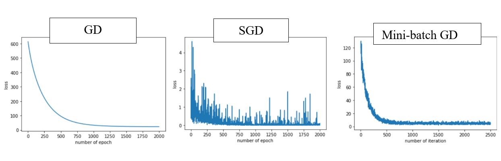
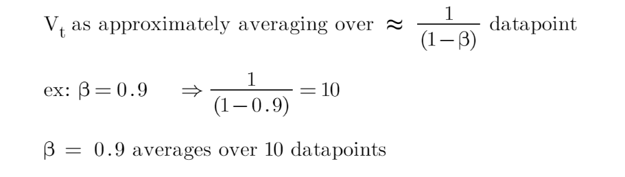

**Adadelta**

Adadelta is an adaptive learning rate optimization algorithm used for
training machine learning models, particularly in deep learning and
neural networks. It is an extension and improvement over the Adagrad
algorithm, designed to address some of Adagrad\'s limitations,
particularly the issue of continually decreasing learning rates.
Adadelta was introduced by Matthew Zeiler in his paper titled
\"ADADELTA: An Adaptive Learning Rate Method\" in 2012.

Adadelta shares the idea of adapting learning rates to individual
parameters based on their historical gradients, but it introduces
several modifications to make it more robust and efficient. Here\'s how
Adadelta works in detail:

{width="6.268055555555556in"
height="6.961111111111111in"}

\*\*Advantages of Adadelta\*\*:

1\. \*\*Adaptive Learning Rates\*\*: Adadelta automatically adapts
learning rates for individual parameters, making it less sensitive to
the choice of a global learning rate.

2\. \*\*Numerical Stability\*\*: The use of accumulated squared
parameter updates and gradients, along with the addition of
\\(\\epsilon\\), enhances numerical stability.

3\. \*\*No Need for Learning Rate Tuning\*\*: Adadelta eliminates the
need for manually tuning the learning rate, making it more
user-friendly.

4\. \*\*Effective for Non-Stationary Data\*\*: Adadelta can handle
non-stationary and noisy data effectively because it uses a moving
average of past parameter updates.

\*\*Disadvantages of Adadelta\*\*:

1\. \*\*Memory and Computational Overhead\*\*: Adadelta requires
additional memory and computational resources to maintain accumulators
for each parameter.

2\. \*\*May Still Need Hyperparameter Tuning\*\*: Although it has fewer
hyperparameters than some other optimizers, Adadelta may still require
tuning of the hyperparameters, such as \\(\\rho\\) and \\(\\epsilon\\),
in certain cases.

In practice, Adadelta is a popular optimization algorithm for training
deep neural networks and is known for its robustness and effectiveness
in adapting learning rates. It is often used in combination with other
techniques like mini-batch training and early stopping for efficient and
effective model training.

**Limitations of Adadelta**

1.  **Complexity**:

    -   Adadelta is more complex to implement and understand compared to
        simpler optimization algorithms like SGD.

2.  **Hyperparameter Sensitivity**:

    -   While Adadelta reduces the dependency on the initial learning
        rate, the decay rate (rho) still needs to be carefully tuned for
        optimal performance.

3.  **Memory Consumption**:

    -   Similar to Adagrad, Adadelta needs to maintain moving averages
        of squared gradients and squared updates for each parameter,
        which can consume significant memory for large models.

4.  **Slower Convergence**:

    -   In some cases, Adadelta may converge more slowly compared to
        other adaptive learning rate methods like RMSprop and Adam,
        especially for non-convex optimization problems.

[[Adadelta]{.underline}](https://golden.com/wiki/Adadelta) is an
extension of Adagrad that attempts to solve its radically diminishing
learning rates. The idea behind Adadelta is that instead of summing up
all the past squared gradients from 1 to "t" time steps, what if we
could restrict the window size. For example, computing the squared
gradient of the past 10 gradients and average out. This can be achieved
using Exponentially Weighted Averages over Gradient.

{width="6.268055555555556in"
height="1.0097222222222222in"}

The above equation shows that as the time steps "t" increase the
summation of squared gradients "α" increases which led to a decrease in
learning rate "η". In order to resolve the exponential increase in the
summation of squared gradients "α", we replaced the "α" with
exponentially weighted averages of squared gradients.

{width="6.268055555555556in"
height="1.117361111111111in"}

So, here unlike the alpha "α" in Adagrad, where it increases
exponentially after every time step. In Adadelda, using the
exponentially weighted averages over the past Gradient, an increase in
"S*dw" *is under control.

RMSprop, short for Root Mean Square Propagation, is an optimization
algorithm used in machine learning and deep learning to adapt the
learning rate during training. It is designed to mitigate some of the
limitations of traditional gradient descent, particularly when dealing
with problems involving sparse data or ill-conditioned optimization
surfaces. RMSprop is part of a family of adaptive learning rate
algorithms that automatically adjust the learning rates for different
parameters based on their past gradients.

Here\'s a detailed explanation of how RMSprop works:

\### Basic Idea:

RMSprop adapts the learning rates individually for each parameter during
training. It does so by keeping track of a moving average of the squared
gradients of each parameter. The intuition behind this is to give
smaller learning rates to parameters that are updated frequently and
larger learning rates to parameters that are updated less often. This
helps prevent divergence and accelerates convergence.

{width="6.189583333333333in"
height="7.657638888888889in"}

\### Advantages of RMSprop:

1\. \*\*Adaptive Learning Rates\*\*: RMSprop adapts the learning rates
individually for each parameter. This is especially helpful when dealing
with high-dimensional and complex optimization problems.

2\. \*\*Robustness to Sparse Gradients\*\*: RMSprop is less sensitive to
noisy or sparse gradients, making it suitable for a wide range of
machine learning tasks.

3\. \*\*Automatic Adjustment\*\*: It doesn\'t require manual tuning of
learning rates as frequently as standard gradient descent.

\### Limitations of RMSprop:

1\. \*\*Hyperparameter Sensitivity\*\*: Like many optimization
algorithms, the performance of RMSprop depends on the choice of
hyperparameters, such as the initial learning rate (\`η\`) and the decay
rate (\`γ\`).

2\. \*\*Lack of Momentum\*\*: RMSprop does not include momentum, which
is present in algorithms like Adam. This can sometimes result in slower
convergence in certain cases.

In practice, RMSprop is widely used in various deep learning
applications and is often the optimizer of choice for tasks like
training neural networks for image recognition, natural language
processing, and more. It provides a good balance between adaptive
learning rate adjustment and simplicity of use.

RMSProp (Root Mean Squared Propagation) is an adaptive learning
rate [optimization
algorithm](https://www.geeksforgeeks.org/optimization-techniques-for-gradient-descent/).
It is an extension of the popular[ Adaptive Gradient
Algorithm](https://www.geeksforgeeks.org/intuition-of-adam-optimizer/) and
is designed to dramatically reduce the amount of computational effort
used in training [neural
networks.](https://www.geeksforgeeks.org/artificial-neural-networks-and-its-applications/) This
algorithm works by exponentially decaying the learning rate every time
the
squared [gradient](https://www.geeksforgeeks.org/gradient-descent-algorithm-and-its-variants/) is
less than a certain threshold. This helps reduce the learning rate more
quickly when the gradients become small. In this way, RMSProp is able to
smoothly adjust the learning rate for each of the parameters in the
network, providing a better performance than regular Gradient Descent
alone.

The RMSprop algorithm utilizes exponentially weighted moving averages of
squared gradients to update the parameters. Here is the mathematical
equation for RMSprop:

1.  Initialize parameters:

    -   Learning rate: α

    <!-- -->

    -   Exponential decay rate for averaging: γ

    <!-- -->

    -   Small constant for numerical stability: ε

    <!-- -->

    -   Initial parameter values: θ

<!-- -->

2.  Initialize accumulated gradients (Exponentially weighted average):

    -   Accumulated squared gradient for each parameter: *Et*​= 0

<!-- -->

3.  Repeat until convergence or maximum iterations:

    -   Compute the gradient of the objective function with respect to
        the parameters:

    <!-- -->

    -   Update the exponentially weighted average of the squared
        gradients:

    <!-- -->

    -   Update the parameters:

where,

-   *gt* is the gradient of the loss function with respect to the
    parameters at time* t*

<!-- -->

-   is a decay factor

<!-- -->

-   *Et*​ is the exponentially weighted average of the squared gradients

<!-- -->

-   α is the learning rate

<!-- -->

-   *ϵ *is a small constant to prevent division by zero

This process is repeated for each parameter in the optimization problem,
and it helps adjust the learning rate for each parameter based on the
historical gradients. The exponential moving average allows the
algorithm to give more importance to recent gradients and dampen the
effect of older gradients, providing stability during optimization.
