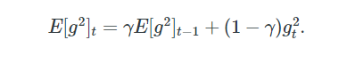

**Adagrad**

**          Adagrad stands for an adaptive gradient**. Adagrad is** **an
effective algorithm for gradient-based optimization. It adapts the
learning rate to the parameters, using low learning rates for parameters
associated with frequently occurring features, and using high learning
rates for parameters associated with rare features.

Therefore, it is well suited when dealing with sparse data.

But the same update rate may not fit all parameters. For example, some
parameters may have reached a stage where only fine adjustment is
required, but some parameters need to be adjusted significantly due to
the small number of matching samples.

Adagrad raised this issue, an algorithm that offers different learning
rates at different parameters between them. What this means is that for
each parameter, as its total distance updated increases, its learning
rate is also slow.

GloVe word embedding uses **Adagrad **where rare words need major
updates and common words need a little update.

Adagrad removes the need to manually tune the learning rate.

There are mainly three problems that arise with the Adagrad algorithm.

-   The learning rate is monotonically decreasing.

-   The learning rate in the late training period is very small.

-   it needs to be set by doing the initial global learning rate.

Let's see how it works

In this algorithm, we try to change the learning rate (alpha) for each
update. The learning rate changes during each update as it will decrease
if the weight is significantly updated in the short term again and it
will increase if the weight is not significantly updated.

First, each weight has its own cache value, which collects the squares
of the gradients up to the current point.

{width="6.268055555555556in"
height="0.9805555555555555in"}

The cache value will continue to increase as training continues. Now a
new update formula can be provided as mentioned below:

{width="6.268055555555556in"
height="0.8118055555555556in"}

The above formula is the same as the original gradient descent formula
except that here the learning rate (alpha) constantly changes throughout
the training process. The E in the denominator which is shown in the
above formula is a very small value which helps us to ensure that the
division by zero does not occur.

Essentially what's happening here is that if a weight has been
having **very huge updates**, its cache value is also going
to **increase**. As a result, the learning rate will be lower and the
size of the weight update will decrease over time.

On the other hand, if a weight has not been having any significant
update, its cache value is going to be very less, and hence its learning
rate will increase, forcing it to take bigger updates. This is the basic
principle of the Adagrad optimizer.

However, the disadvantage of this algorithm is that even if there are
previous weight gradients, the cache will always increase by a certain
amount because the square cannot be negative. Therefore the learning
rate of all weights will eventually drop to a very low level until the
training is less intense.

Adagrad can be visualize as:

{width="6.268055555555556in"
height="2.86875in"}

To overcome the problem of Adagrad there is many other optimizers
algorithm available. One of them is **Adadelta**.

**Adadelta**

          In Adadelta, we do not need to set a default reading rate as
we take the effective rate of past steps to the current gradient.

There are three major problems that arise with the Adagrad algorithm.

-   The learning rate is monotonically decreasing.

-   The learning rate during the late training period is very low.

-   it needs to be set by doing the initial global learning rate.

\- **Adagrad Overview:**

\- Stands for adaptive gradient.

\- Effective for gradient-based optimization.

\- Adapts learning rate to parameters:

\- Low rates for frequent features.

\- High rates for rare features (suitable for sparse data).

\- Parameter-Specific Learning Rates:

\- Addresses varying update needs for parameters.

\- Slows learning rate as parameter updates increase.

\- Usage in GloVe Word Embedding:

\- Major updates for rare words.

\- Minor updates for common words.

\- Eliminates manual learning rate tuning.

\- Challenges:

\- Monotonically decreasing learning rate.

\- Very small late-training period learning rate.

\- Requires initial global learning rate setting.

\- Working Mechanism:

\- Learning rate (alpha) changes per update.

\- Each weight has a cache value for squared gradients.

\- Update formula:

\- Theta_t+1 = Theta_t - (alpha / sqrt(G_t + epsilon)) \* g_t

\- G_t is the cache value, epsilon prevents division by zero.

\- Learning rate decreases with significant updates, increases
otherwise.

\- Disadvantages:

\- Cache value always increases.

\- Leads to decreasing learning rates until training intensity reduces.

**Limitations of Adagrad**

1.  **Learning Rate Decay**:

    -   Adagrad continuously decays the learning rate, which can become
        very small over time. This may cause the algorithm to stop
        learning before reaching the optimal solution.

2.  **Memory Consumption**:

    -   Adagrad needs to maintain a sum of the squared gradients for
        every parameter, which can consume a lot of memory for large
        models.

3.  **Suitability**:

    -   Adagrad is not always suitable for non-convex problems or deep
        learning tasks where continued exploration of the parameter
        space is necessary.

Despite these limitations, Adagrad remains a useful optimization
algorithm for sparse data and problems where different features have
different frequencies of occurrence.

Adadelta is an extension of Adagrad and also tries to reduce Adagrad\'s
rate of learning, excessively.

It does this by limiting the gradient window that has been exceeded to a
certain size ***w***.  Running average at time ***t*** then depends on
the previous average and the current gradient.  

In Adadelta, we** **don\'t have to set the default learning rate as we
take the ratio of the running average of the previous time steps to the
current gradient.

Let's see and understand how its work

In the Adadelta optimizer algorithm, it will try not to accumulate all
past squared gradients values. It instead tries to restrict the window
of accumulated past gradients to some fixed size **(say w).**

Here, it Instead of inefficiently storing w previous squared gradients
value, the sum of gradients is recursively defined as a decaying average
of all past squared gradients.

The running average **E\[g2\]t** at time step** t** then depends (as a
fraction** γ** similarly to the Momentum term) only on the previous
average and the current gradient value:

{width="4.15in"
height="0.75in"}

EMA(t) = α \* Data(t) + (1 - α) \* EMA(t-1)

-   **EMA(t)** is the Exponential Moving Average at time t.

-   **α** (alpha) is the smoothing factor, which is a number between 0
    and 1.

-   **Data(t)** is the data point at time t.

-   **EMA(t-1)** is the EMA at the previous time step (t-1).

Next, we set **γ **to a similar value as the momentum term, say around
0.8. To be more specific, lets now rewrite our vanilla SGD update as
shown in the image below according  to the parameter update vector Δθt:

{width="5.166666666666667in"
height="1.0833333333333333in"}

The parameter update vector of Adagrad that we derived previously can
also be written as shown below:

{width="4.366666666666666in"
height="0.7416666666666667in"}

Now we can simply replace the diagonal matrix** Gt** with the decaying
average over past squared gradients **E\[g2\]t **as shown below:

{width="6.268055555555556in"
height="0.84375in"}

Now as the denominator is just the root mean squared (RMS) error of the
gradient, we can replace it with the criterion short-hand as shown
below:

{width="4.25in"
height="1.0833333333333333in"}

Note: The units in this update (as well as in SGD, Momentum, or
Adagrad)  are incompatible, meaning that the update must have the same
assumptions as of the parameter. To realize this, we have to first
define another exponentially decaying average, this time not of squared
gradients but of squared parameter updates. It is shown below:

{width="5.316666666666666in"
height="0.8583333333333333in"}

The **root mean squared error** of parameter updates can be given by as
follows:

{width="4.708333333333333in"
height="0.7166666666666667in"}

Since **RMS\[Δθ\]t **is unknown, we approximate it with the RMS of
parameter updates until the previous time step. Replacing the learning
rate** η **in the previous update rule with **RMS\[Δθ\]t−1**. Finally,
the Adadelta update rule can be given as shown below:

{width="3.9in" height="1.45in"}

Note: With Adadelta, we do not even need to set a default learning rate,
as it has been eliminated from the update rule.

**Adadelta can be visualize as:**

{width="6.268055555555556in"
height="2.9923611111111112in"}

**Limitations of RMSprop**

1.  **Hyperparameter Sensitivity**:

    -   The performance of RMSprop can be sensitive to the choice of
        hyperparameters, particularly the learning rate and decay rate.
        Careful tuning is required for optimal performance.

2.  **Non-Convex Optimization**:

    -   Like other gradient-based optimization methods, RMSprop can get
        stuck in local minima in non-convex optimization problems.

3.  **Vanishing Learning Rates**:

    -   Despite addressing the diminishing learning rates problem of
        Adagrad, RMSprop can still suffer from vanishing learning rates
        for some parameters, especially if the decay rate is set too
        high.

4.  **Memory Consumption**:

    -   RMSprop requires maintaining a running average of squared
        gradients for each parameter, which can increase memory usage
        for large models.

5.  **Implementation Complexity**:

    -   RMSprop is more complex to implement compared to simpler
        algorithms like SGD, which may lead to difficulties in debugging
        and maintenance.
